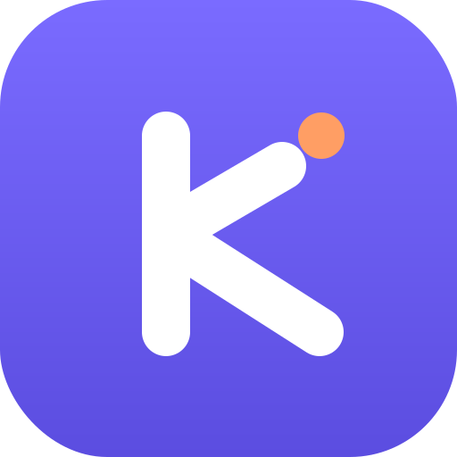

  
  <h1>Kukku v1.0.0</h1>
  
<em>Local by design. Personal by default.</em>

The first official release of **Kukku** — a private, local-first personal AI that
runs on your Mac and answers on **Telegram** and a premium **web dashboard**. One
brain, two front doors, zero cloud tax.

---

## ✨ Highlights

- 🧠 **One brain, everywhere** — the same agent, memory, and database power both
  Telegram and the dashboard, syncing live.
- 🔍 **Find anything on your Mac** — semantic + keyword + OCR search. *"the
  screenshot where Docker failed"* just works.
- 🔒 **Private by default** — everything runs on `127.0.0.1`, on free model tiers.
  Your data never leaves home.
- 🎨 **A real product** — full brand identity, responsive dashboard, wired icons
  and PWA manifest, and a premium README.

## 🚀 Major features

- **Telegram bot** — streaming tool-use agent, allowlisted by user ID.
- **Web dashboard** (Next.js) — Argon2 + JWT login and 10 modules: AI Chat
  (streaming, live sync, voice in/out), Universal Search, Memory, Files, OCR,
  Automation, Developer, Monitor, Notifications, Settings. Responsive to mobile.
- **Hybrid file search** — filename + content + semantic (ChromaDB), recency-boosted.
- **OCR** (Tesseract) and **local voice transcription** (faster-whisper), EN + HI.
- **Hindi / Hinglish** replies that mirror your script.
- **Allowlisted local commands**, **web search**, **reminders**, **battery/disk
  alerts**, **weather**, and **daily DB backup** — most at zero LLM cost.
- **Multi-provider failover** — Gemini → Groq → OpenRouter, or fully-local Ollama.
- **Optional Cloudflare relay** so the bot answers while your Mac sleeps.

## 🔐 Security

- Every dashboard data endpoint is authenticated (Argon2id + JWT, rate-limited
  login). Backend binds to `127.0.0.1`; only your Telegram ID is accepted.
- No arbitrary shell (list-arg `subprocess` + allowlist); parameterized SQL;
  file downloads are `$HOME`-jailed and must be indexed.
- The legacy unauthenticated dashboard was removed; regression tests assert `401`
  for unauthenticated access. Private vulnerability reporting via
  [`docs/SECURITY.md`](docs/SECURITY.md#reporting-a-vulnerability).

## ⚡ Performance

- Lazy-loaded heavy libraries (embeddings, Whisper, Chroma) → instant boot.
- WAL-mode SQLite, threaded indexer + file watchdog, per-provider cooldowns, and
  a search cache. All 27 runtime dependencies are version-pinned.

## 📚 Documentation

- Premium README, a full engineering docs set under `docs/` (architecture,
  workflow, install, features, API reference, troubleshooting, recovery, FAQ,
  security), `CONTRIBUTING.md`, `CHANGELOG.md`, `LICENSE` (MIT), and a complete
  brand guide in `docs/brand/`.

## ⚠️ Known limitations

- **macOS-first** for local commands and indexing (backend/dashboard portable; Docker supported).
- **Settings are read-only in the UI** (edit `.env` + restart).
- **No image/vision input** in chat yet; **no ⌘K palette** or installable PWA service worker yet.
- Add your own screenshots to `docs/images/` and uncomment the README grid.

## 🔮 Upcoming in v1.1

⌘K command palette · image vision in chat (Gemini multimodal) · installable PWA ·
settings write-through · Calendar + Gmail modules. See [`docs/ROADMAP.md`](docs/ROADMAP.md).

---

**Quality bar:** 161 tests passing · `ruff` clean · web `tsc` + production build clean.

**Install:** see the [README](README.md#-quick-start). **License:** [MIT](LICENSE).

<b>Kukku</b> · Always on. Always yours.

