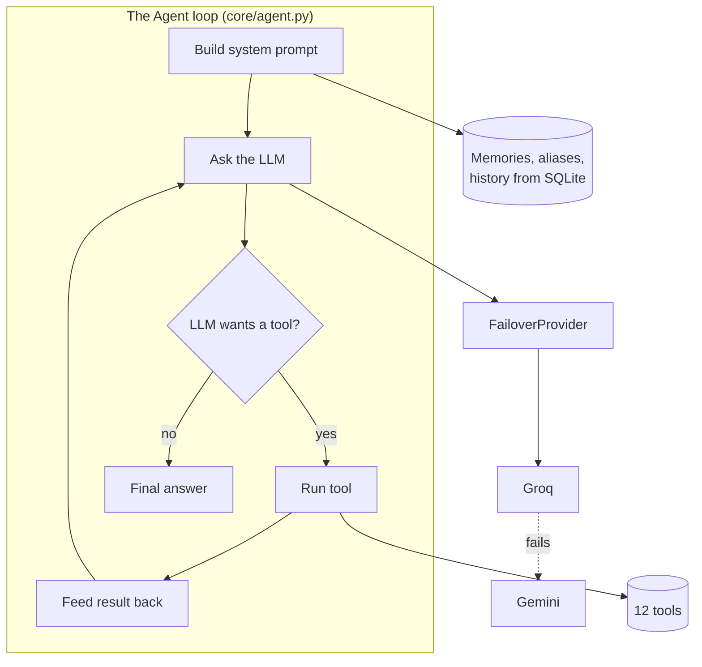
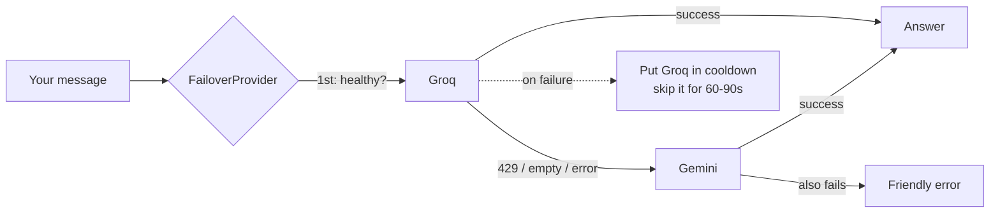
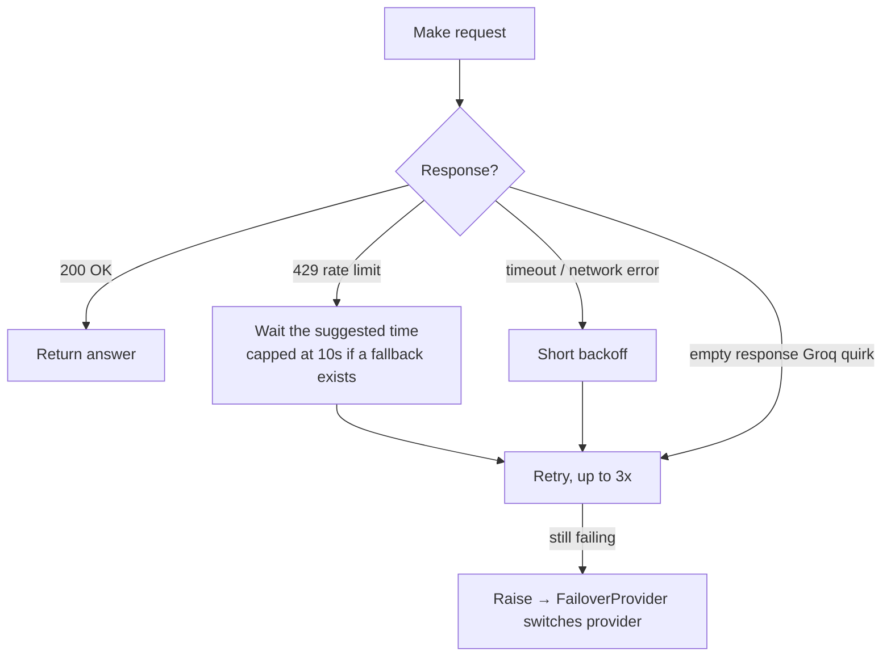
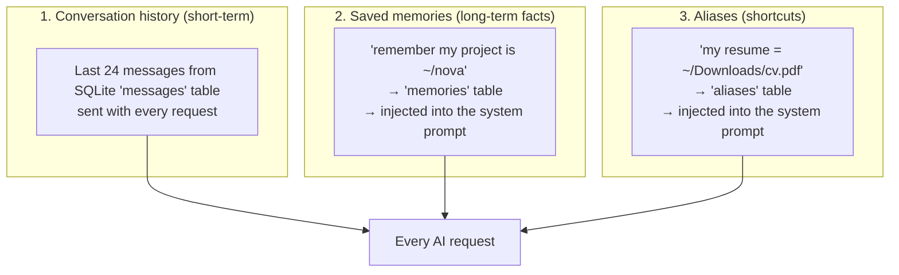
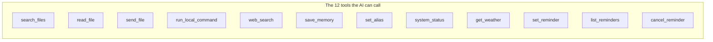
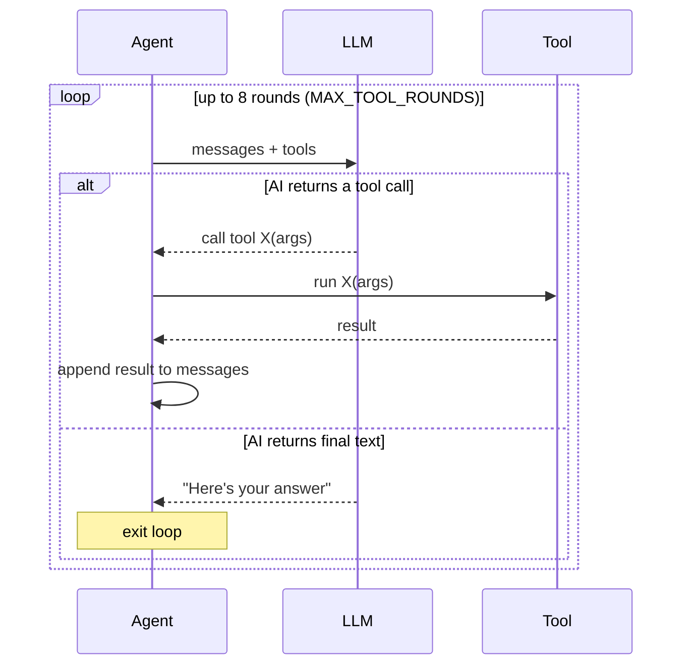
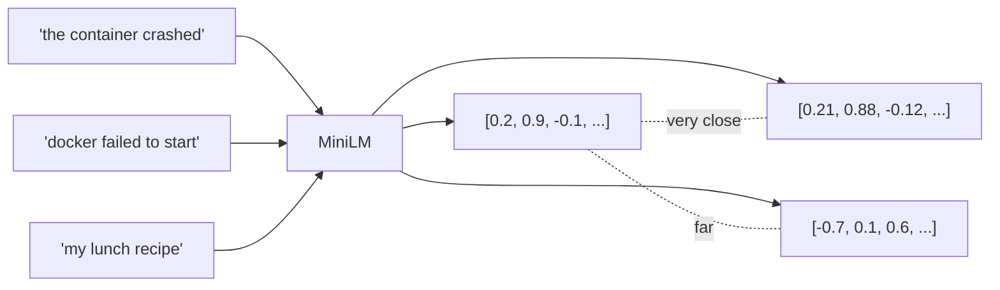
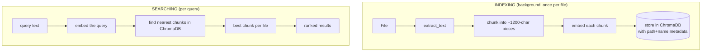
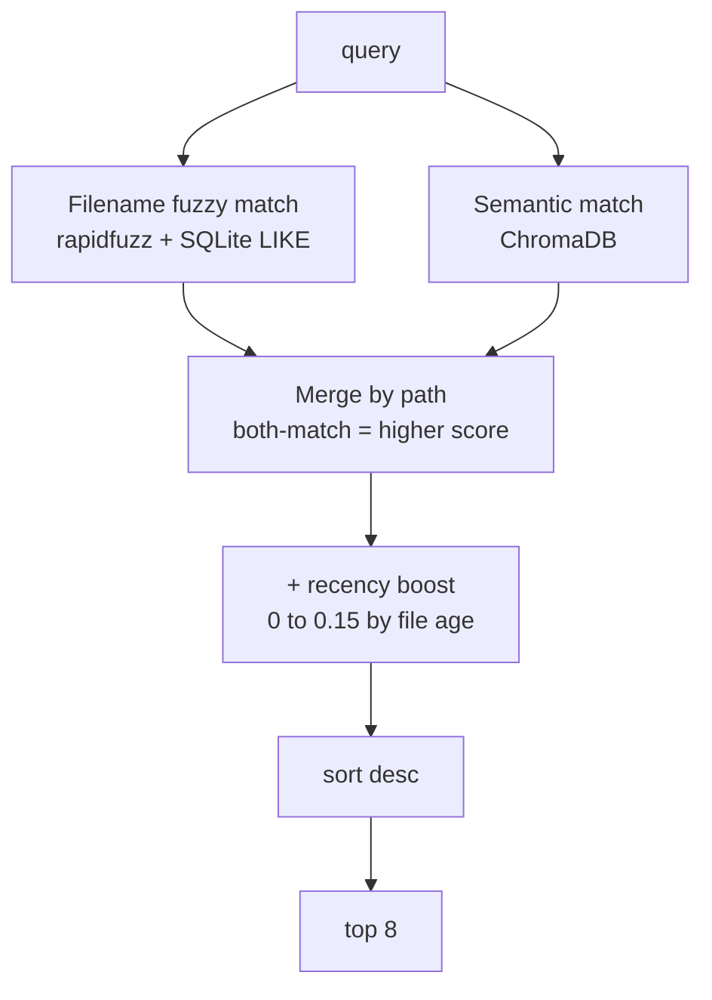
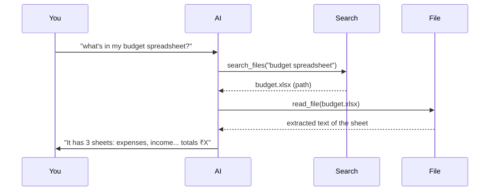

# AI Architecture (Part 7)

How the "brain" actually works: providers, failover, retries, rate limits, memory,
context, prompts, tool calling, embeddings, and semantic search — each explained
from first principles.

---

## The big picture



---

## 1. Providers: Groq, Gemini, and the failover chain

Kukku can talk to several AI providers, all through one code path.

### The provider classes (`app/core/llm.py`)

| Class | Handles | Notes |
|---|---|---|
| `ClaudeProvider` | Anthropic Claude | Only if you add a paid key |
| `OpenAICompatProvider` | Gemini, Groq, OpenRouter, Ollama | One class, many providers — they all speak the "OpenAI-compatible" API shape |
| `FailoverProvider` | The chain of the above | Tries them in order |

### How the chain is built
`build_provider()` reads `LLM_PRIORITY` (default `groq,gemini,claude,openrouter,
ollama`) and assembles only the ones you have keys for, in that order. With more
than one, it wraps them in a `FailoverProvider`.



### Why Groq is primary
Groq's free tier is far more generous than Gemini's. Making Groq primary means
your everyday messages don't burn Gemini's small quota — Gemini stays in reserve
for when Groq is busy or for web-search grounding. Both are free. Change the order
by editing `LLM_PRIORITY` in `.env`.

---

## 2. Retries and rate limits

### What a rate limit is
Free AI tiers cap how many requests you can make. Gemini's is about **20 requests
per minute** (a burst limit) plus a daily cap. When you exceed it, the API returns
HTTP **429** ("Too Many Requests"), often with "retry in 15s".

### How Kukku retries (`OpenAICompatProvider.turn`)


Three failure types are handled:
1. **`RateLimitError`** (429) — waits the API-suggested time, retries.
2. **Network/timeout** — short backoff, retries.
3. **`EmptyResponseError`** — Groq's Llama sometimes returns nothing; treated as a
   retryable failure so it never reaches you blank.

### How failover uses cooldowns
When a provider fails, `FailoverProvider` puts it in a **cooldown** (60s for quota,
90s for network) so the *next* messages skip straight to the working provider
instead of re-hitting the dead one. When the cooldown lapses, it's tried again.
You never see the switch — same tools, same answer quality.

---

## 3. Context & memory (how the AI "remembers")

There are **three layers** of memory, easy to confuse:



| Layer | Lifespan | Stored in | How it's used |
|---|---|---|---|
| **Conversation history** | Rolling last 24 messages | `messages` table | Sent as prior turns so "my" / "that file" make sense |
| **Memories** | Forever (until deleted) | `memories` table | Listed inside the system prompt every turn |
| **Aliases** | Forever | `aliases` table | Listed inside the system prompt every turn |

**Why 24 messages?** (`HISTORY_LIMIT`) A balance: enough for context, not so much
that you waste tokens (and money/quota) resending a huge history every time.

**Important nuance:** The LLM itself is *stateless* — it remembers nothing between
requests. The *illusion* of memory comes from Kukku re-sending the relevant
history and memories with every single request. That's why `/clear` (which wipes
the `messages` table for a chat) makes it "forget" the conversation.

---

## 4. How the system prompt is generated

Every turn, `Agent._system_prompt()` builds a fresh instruction block:

```
You are Kukku, <you>'s personal assistant... [identity + capabilities]

Guidelines:
- Be concise, use Telegram Markdown...
- Search files before answering from general knowledge...
- Language: reply in the SAME language and script the user used...
- For shutdown/restart: ask to confirm first...

Additional tools: get_weather, set_reminder...
Indexed directories: /Users/you/Desktop, ...
Current local time: 2026-07-05 18:30 Saturday

Saved memories:
- likes dark mode
- project folder is ~/nova

Aliases:
- my resume -> /Users/you/Documents/resume.pdf
```

**Why rebuild it every turn?** Because memories, aliases, and the current time
change. The time especially matters — it's how the AI computes "remind me at 5pm"
into an actual timestamp.

---

## 5. Tool calling — the heart of everything

### The concept
The LLM has no ability to touch your files or run commands. Tool calling is the
bridge: you give the AI a **menu** of tools (with descriptions and argument
schemas), and it responds with "I want to call *this* tool with *these*
arguments." Your code runs it and hands back the result.

### The menu (`TOOLS` in `agent.py`)


Each tool is a JSON schema — a name, a description (the AI reads this to decide when
to use it), and the arguments it takes. Example:
```json
{ "name": "get_weather",
  "description": "Current weather + today's high/low for a city (free, no key).",
  "input_schema": { "type": "object",
    "properties": { "city": {"type": "string"} }, "required": ["city"] } }
```

### The loop (`Agent.run`)


The loop caps at **8 rounds** so a confused AI can't loop forever. Most requests
finish in 1–3.

### The Groq quirk (and the fix)
Groq's Llama sometimes emits a tool call as *text* (`<function/search_files{...}
</function>`) instead of the structured format. `_extract_text_tool_calls()` in
`llm.py` detects and parses that, so tool calling works no matter which provider
handled the turn. It also sends `temperature: 0` to make Groq's tool-calling
deterministic.

---

## 6. Semantic search & embeddings (deep dive)

### The problem with keyword search
If you search "docker failed" but your file says "container wouldn't start", a
keyword search finds nothing. Semantic search understands they *mean* the same
thing.

### Embeddings: turning meaning into numbers
An **embedding model** (`all-MiniLM-L6-v2`) reads text and outputs 384 numbers that
encode its meaning. Texts with similar meaning get similar number-lists.



### Cosine similarity: measuring closeness
To compare two embeddings, we measure the **angle** between them (cosine
similarity). 1.0 = identical meaning, 0 = unrelated. ChromaDB does this comparison
across all your stored file-chunks in milliseconds.

### The full indexing → search pipeline


**Chunking** (splitting files into ~1200-character pieces with 150-char overlap)
matters because: (a) embeddings work best on focused pieces, not whole books, and
(b) it lets search point you at the *relevant part* of a big document. The overlap
ensures a sentence split across two chunks isn't lost.

### Hybrid search (the real implementation)
`FileSearch.search()` doesn't rely on semantic search alone — it combines it with
fuzzy filename matching and a recency boost:



This is more robust than either method alone: filename search nails exact names,
semantic search catches meaning, and recency breaks ties toward what you touched
recently.

---

## 7. RAG (Retrieval-Augmented Generation) in Kukku

When you ask *"what's in my budget spreadsheet?"*, the AI can't know — it's never
seen your file. RAG solves this:



**Retrieval** (find + read the file) → **Augmented** (add that text to the AI's
context) → **Generation** (AI writes an answer grounded in it). Kukku's
`search_files` + `read_file` tools *are* a RAG pipeline, driven by the AI itself
rather than a fixed chain.

---

## 8. Cost model (why it's ~free)

| Operation | AI cost |
|---|---|
| Chat / file search / commands | 1–3 LLM calls (Groq free tier) |
| Web search | 1 Gemini grounding call |
| Voice transcription | **0** (local Whisper) |
| Embedding / semantic search | **0** (local MiniLM) |
| OCR | **0** (local Tesseract) |
| Reminders / alerts / weather / backup | **0** (pure logic / free API) |

The design deliberately pushes as much as possible to **local, free** computation,
using paid-tier-but-free AI only for the actual "thinking."

Next: [FEATURES.md](FEATURES.md) or [SECURITY.md](SECURITY.md).
