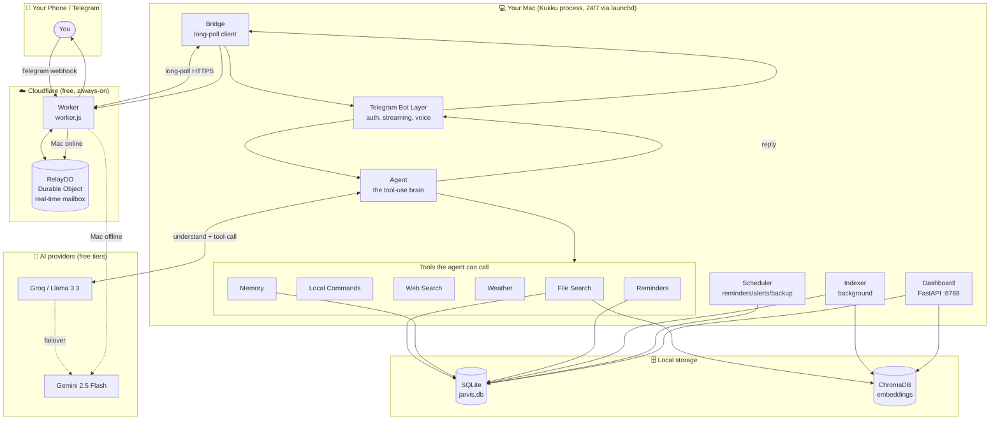
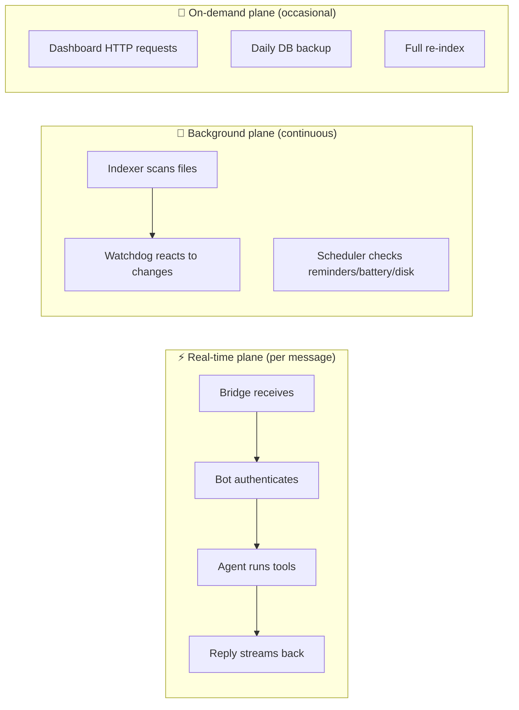
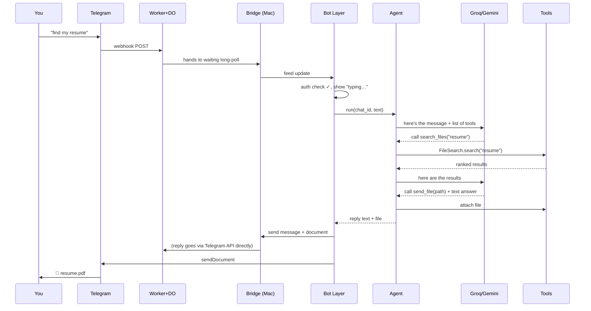
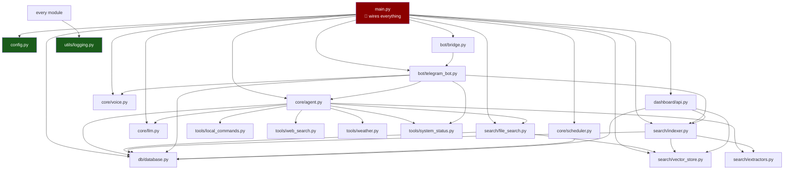
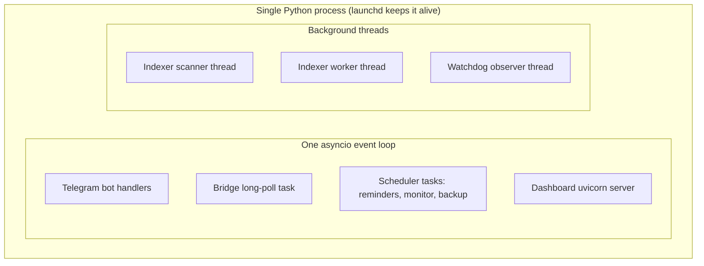

# Architecture (Part 1 & Part 13)

This document explains **what the system is made of, why each piece exists, how a
request travels through it, and how the files depend on each other.**

---

## 1. The problem Kukku solves

You have a laptop full of files, projects, and screenshots. You want to ask
questions like *"find the screenshot where Docker failed"* or *"send me my
resume"* from your phone, in plain language, and get an answer — even when you're
not at your desk. Existing assistants (Siri, etc.) can't see your files or run
your commands. Kukku does, because it runs **on your machine** and is reachable
**through Telegram**, which you already have on your phone.

Concretely, Kukku solves four problems:

| Problem | Kukku's answer |
|---|---|
| "I can't find my own files" | Semantic search — search by *meaning*, not just filename |
| "I want to control my Mac remotely" | Allowlisted local commands over Telegram |
| "I want a private AI assistant" | Free LLMs + local data; nothing sold to third parties |
| "I want it available all the time" | Cloud relay answers even when the Mac sleeps |

---

## 2. High-level architecture

---

## 3. Why each component exists

Think of Kukku as a restaurant. Here's who does what:

| Component | Restaurant analogy | File(s) | Why it exists |
|---|---|---|---|
| **Telegram Bot layer** | The waiter | `app/bot/telegram_bot.py` | Takes your order (message), checks you're allowed in, shows "typing…", streams the reply back, handles voice notes and file uploads |
| **Cloud Relay (Worker + DO)** | The phone line to the kitchen | `cloud/worker.js` | Telegram can't reach your Mac directly (it's behind your router). The Worker is a public address that relays messages. The Durable Object is a real-time mailbox. |
| **Bridge** | The runner carrying orders from phone to kitchen | `app/bot/bridge.py` | The Mac *pulls* messages from the Worker (outbound only), so no fragile tunnel is needed |
| **Agent** | The head chef | `app/core/agent.py` | Decides what to do with your request and coordinates the tools. This is the brain. |
| **LLM providers** | The chef's trained instincts | `app/core/llm.py` | The actual AI models (Groq, Gemini) that understand language and decide which tool to use |
| **Tools** | Kitchen stations (grill, fryer) | `app/tools/`, `app/search/` | The things the chef can actually *do*: search files, run commands, get weather |
| **Indexer** | The prep cook stocking the pantry | `app/search/indexer.py` | Runs in the background reading your files so search is instant later |
| **Scheduler** | The kitchen timer | `app/core/scheduler.py` | Fires reminders, watches battery/disk, backs up the database |
| **Databases** | The pantry + recipe cards | `app/db/database.py` (SQLite), `app/search/vector_store.py` (ChromaDB) | Store your history, memories, reminders, and the searchable "fingerprints" of your files |
| **Dashboard** | The manager's office window | `app/dashboard/` | A local web page showing what's happening inside |

---

## 4. The three "planes" of the system

It helps to split Kukku into three planes that operate on different timescales:

- **Real-time plane**: everything that happens when you send a message. Must be
  fast. Lives in `bot → agent → tools`.
- **Background plane**: always running, never blocks a message. Indexing and
  scheduling live here, in their own threads/tasks.
- **On-demand plane**: things triggered rarely — you opening the dashboard, the
  nightly backup, a manual `/reindex`.

---

## 5. How a request travels (summary)

The full trace is in [WORKFLOW.md](WORKFLOW.md). The short version:

---

## 6. Design decisions (and why)

These are the choices that shape the whole system. Understanding *why* helps you
avoid "fixing" things that are intentional.

| Decision | Why | Alternative rejected |
|---|---|---|
| **No LangChain** | The agent needs one thing — a tool loop — which is ~50 lines against the raw LLM API. Fewer dependencies, full control over streaming. | LangChain (heavy, leaky abstractions, breaks on version bumps) |
| **Mac long-polls the cloud** (no tunnel) | Outbound connections always work behind any router. Tunnels (`cloudflared` quick tunnels) die silently and are throttled. | cloudflared quick tunnel (unreliable — see git history) |
| **Groq primary, Gemini fallback** | Groq's free tier is far more generous; keeps Gemini's small quota in reserve. Both are free. | Gemini-only (hits daily cap fast) |
| **SQLite, not Postgres** | One user, one machine. SQLite is zero-setup, a single file, and plenty fast. | Postgres (needs a server, overkill) |
| **ChromaDB, not FAISS** | Chroma persists to disk automatically and handles metadata. FAISS is faster but you'd hand-roll persistence. | FAISS (more setup for no real gain here) |
| **Everything lazy-loaded** | The heavy libraries (embeddings, Whisper, Chroma) load only when first used, so the app boots instantly and runs even if one is missing. | Eager imports (slow boot, one missing dep kills everything) |
| **Allowlist for commands** | The AI can *never* run arbitrary shell — only a fixed menu of safe actions. | Letting the LLM run raw commands (dangerous) |

See [ROADMAP.md](ROADMAP.md) for an honest critique of these choices.

---

## 7. Project dependency map (Part 13)

This shows **which module imports/uses which**. Arrows mean "depends on / calls."

**How to read it:** `main.py` is the wiring hub (red = touch carefully). Everything
depends on `config.py` and `utils/logging.py` (green = stable, safe). The `agent`
is the busiest node — it pulls in the LLM and all the tools. `db/database.py` is
the shared foundation used by almost everyone.

**The golden rule of the dependency graph:** dependencies flow *downward and
inward*. `bot` uses `agent`; `agent` uses `tools` and `llm`; `tools` use `db`.
Nothing lower-level ever imports something higher-level (e.g., `db` never imports
`agent`). This keeps the system layered and testable. If you ever find yourself
wanting `database.py` to import `agent.py`, stop — you're about to create a
circular dependency, and the design is telling you the logic belongs elsewhere.

---

## 8. What runs where (process/thread model)

- **One event loop** runs the bot, the bridge, the scheduler, and the dashboard
  concurrently (async = they take turns without blocking each other).
- **Blocking work** (reading a PDF, computing an embedding, running `tesseract`)
  is pushed to **threads** via `run_in_executor`, so it never freezes the loop.
- The **indexer** and **watchdog** run in their own threads because file scanning
  is heavy and long-running.

This is why Kukku can answer your message *while* it's indexing 3,000 files in
the background — they're on different execution tracks.

---

Next: [PROJECT_STRUCTURE.md](PROJECT_STRUCTURE.md) explains every file, or jump to
[WORKFLOW.md](WORKFLOW.md) to trace a real message.
