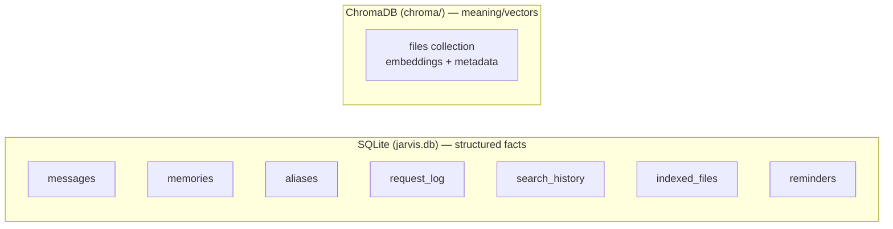
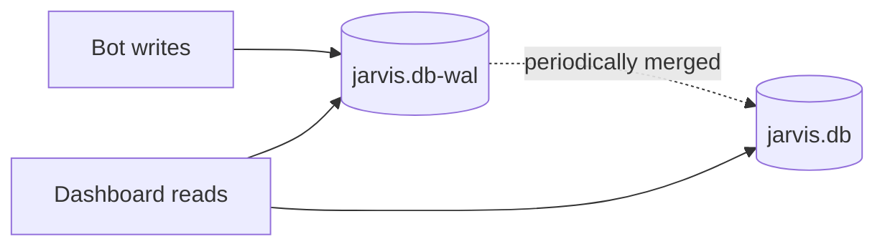
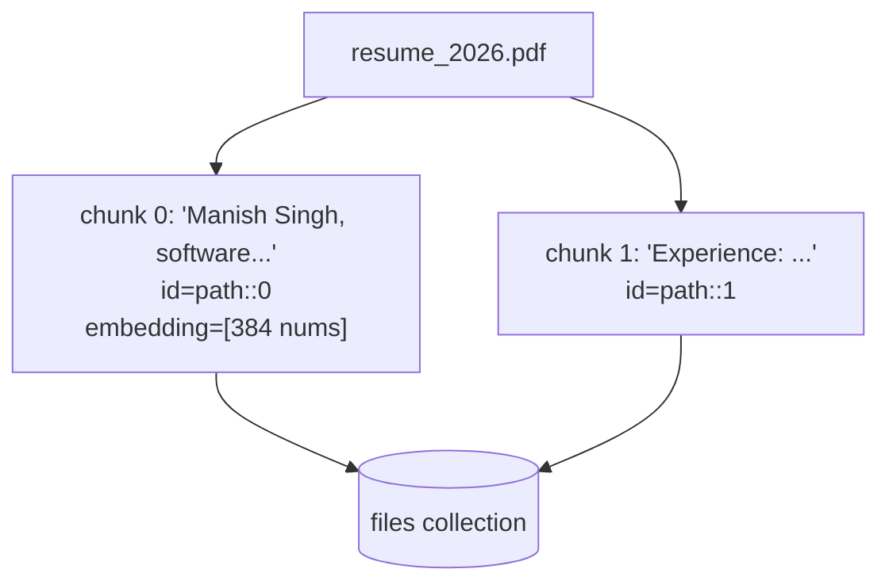

# Databases & Storage (Part 9)

Everything Kukku stores, where it lives, and how it's structured.

---

## Where everything lives

```
data/                        # git-ignored, created at runtime
├── jarvis.db                # SQLite: the structured database
├── jarvis.db-wal            # SQLite write-ahead log (transient)
├── jarvis.db-shm            # SQLite shared-memory index (transient)
├── chroma/                  # ChromaDB: embeddings (vector database)
│   └── chroma.sqlite3       # Chroma's own store + hnsw index files
├── logs/
│   └── jarvis.log           # Rotating app log (5 files × 5MB)
├── backups/
│   └── jarvis-YYYYMMDD.db   # Daily DB backups (last 7)
├── inbox/                   # Files you upload to the bot
└── voice/                   # Temp voice notes (auto-deleted after transcription)
```

Two databases, two jobs:



- **SQLite** = the filing cabinet for exact facts (who said what, what's indexed,
  reminders).
- **ChromaDB** = the "meaning index" for semantic search (the 384-number
  fingerprints of your file contents).

---

## SQLite: the 7 tables

All defined in `app/db/database.py` (the `_SCHEMA` string). Every table uses
`CREATE TABLE IF NOT EXISTS`, so adding a new one just appears on next start.

### `messages` — conversation history
| Column | Type | Meaning |
|---|---|---|
| id | INTEGER PK | row id |
| chat_id | INTEGER | which Telegram chat |
| role | TEXT | 'user' or 'assistant' |
| content | TEXT | the message text |
| ts | REAL | unix timestamp |

Used for the AI's short-term memory (last 24 loaded per turn). `/clear` wipes it.

### `memories` — long-term facts
| id | content | ts |
|---|---|---|

Injected into the system prompt every turn. Set via "remember that…".

### `aliases` — shortcuts
| name (PK) | value | ts |
|---|---|---|

"my resume" → a path. Injected into the system prompt.

### `request_log` — audit trail
| id | user_id | kind | request | response_summary | duration_ms | ts |

Every interaction (text/voice/file/command/denied). Powers the dashboard Logs tab
and security auditing.

### `search_history` — what you searched
| id | query | search_type | results_count | top_result | ts |

### `indexed_files` — the file catalog
| Column | Meaning |
|---|---|
| path (PK) | absolute file path |
| name, ext, size, mtime | file metadata |
| file_type | document / code / image / data / other |
| status | indexed / skipped / error |
| chunks | how many embedding chunks it produced |
| error | why it was skipped (e.g. "too large") |
| indexed_at | when |

This is the "what do I know about" table. Filename search queries it directly.

### `reminders` — scheduled reminders
| Column | Meaning |
|---|---|
| id | reminder id |
| chat_id | who to notify |
| text | what to say |
| due_ts | when to fire (epoch) |
| recurrence | 'once' or 'daily' |
| daily_time | "HH:MM" for daily |
| active | 1 = live, 0 = done/cancelled |

The scheduler polls `WHERE active=1 AND due_ts<=now`.

---

## WAL mode explained

SQLite is in **WAL (Write-Ahead Logging)** mode. Normally a writer blocks readers.
WAL lets the bot *write* (log a message) at the same time the dashboard *reads*
(shows stats) without them fighting.



The `-wal` and `-shm` files are normal and transient. **Never delete them while
Kukku is running** — they hold uncommitted writes.

---

## ChromaDB: the vector store

- **One collection: `files`.** Each row is a *chunk* of a file (~1200 chars),
  stored as: an id (`path::chunk_number`), the chunk text, metadata
  (`path`, `name`, `file_type`, `chunk`), and the 384-number embedding.
- **Distance metric:** cosine similarity (`hnsw:space: cosine`).
- **How it's queried:** `vector_store.query(text)` embeds `text` and asks Chroma
  for the nearest chunks, keeping the best chunk per file.



**Consistency:** SQLite's `indexed_files.chunks` should match how many chunks a
file has in Chroma. The indexer keeps them in sync; if they drift, a `/reindex`
or a full rebuild ([RECOVERY.md](RECOVERY.md)) fixes it.

---

## Logs

- **App log:** `data/logs/jarvis.log` — rotating (5 files × 5MB). Everything the
  app does at INFO level and above. Read with `tail -f data/logs/jarvis.log`.
- **Supervisor logs:** `data/logs/launchd.out.log` / `launchd.err.log` — what
  launchd captured (startup crashes show here).
- **Request log:** in SQLite (`request_log` table) — the *user-facing* audit trail,
  shown on the dashboard.

Log levels: noisy libraries (httpx, chromadb telemetry, telegram) are quieted to
WARNING in `utils/logging.py` so the log stays readable.

---

## How data grows over time

| Table/store | Growth | Concern? |
|---|---|---|
| `messages` | ~2 rows per interaction | Low — text is tiny. Prune with `/clear` if huge. |
| `request_log`, `search_history` | 1 row per action | Low. |
| `indexed_files` | 1 row per file | Bounded by your file count. |
| ChromaDB | ~1 vector per 1200 chars of content | The biggest grower. Thousands of files = tens of thousands of vectors = still only hundreds of MB. |
| `logs/` | Capped at 25MB (rotation) | None. |
| `backups/` | Capped at 7 files | None. |

At personal scale this is all comfortably small. See
[PERFORMANCE.md](PERFORMANCE.md) for tuning.

---

## Inspecting the database yourself

```bash
# open the DB
sqlite3 ~/jarvis/data/jarvis.db

# useful queries
SELECT COUNT(*) FROM indexed_files WHERE status='indexed';
SELECT name, chunks FROM indexed_files WHERE file_type='image' AND chunks>0 LIMIT 10;
SELECT content FROM memories ORDER BY id DESC;
SELECT text, datetime(due_ts,'unixepoch','localtime') FROM reminders WHERE active=1;
.quit
```

Do this read-only while Kukku runs (WAL makes it safe). For writes, stop Kukku
first.

Next: [SECURITY.md](SECURITY.md) or [PERFORMANCE.md](PERFORMANCE.md).
