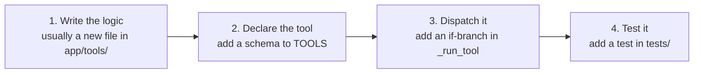

# How to Extend Kukku (Part 12)

How to safely add new capabilities. The golden pattern first, then specific
integrations (Gmail, Calendar, Drive, GitHub, browser control, plugins, etc.).

---

## The golden pattern: adding a new tool

99% of new features are "a new thing the AI can do" = **a new tool**. There are
exactly 3 steps, all in `app/core/agent.py`:



### Worked example: add a "currency converter" tool

**Step 1 — logic** (`app/tools/currency.py`):
```python
import httpx
def convert(amount: float, frm: str, to: str) -> dict:
    r = httpx.get(f"https://api.frankfurter.app/latest",
                  params={"amount": amount, "from": frm, "to": to}, timeout=10)
    return r.json()  # free, no key
```

**Step 2 — declare** (in `TOOLS` list in `agent.py`):
```python
{
  "name": "convert_currency",
  "description": "Convert an amount between two currencies (free, no key).",
  "input_schema": {"type": "object",
    "properties": {"amount": {"type": "number"},
                   "frm": {"type": "string"}, "to": {"type": "string"}},
    "required": ["amount", "frm", "to"]},
},
```

**Step 3 — dispatch** (in `_run_tool` in `agent.py`):
```python
if name == "convert_currency":
    from app.tools.currency import convert
    data = await loop.run_in_executor(None,
        lambda: convert(args["amount"], args["frm"], args["to"]))
    return json.dumps(data)
```

**Step 4 — test** (`tests/test_currency.py`): mock httpx, assert the parse.

That's it. Now "convert 100 usd to inr" works. **This same pattern covers almost
everything below.**

> **Rule:** blocking work (network, disk, subprocess) must go through
> `loop.run_in_executor(None, ...)` so it doesn't freeze the event loop.

---

## Where each kind of change goes

| Change | File(s) | Pattern |
|---|---|---|
| New AI capability | `agent.py` (+ `tools/xyz.py`) | The golden pattern above |
| New `/command` | `telegram_bot.py` | Add a `CommandHandler` |
| New setting | `config.py` | Add a typed field |
| New DB table | `database.py` | Add to `_SCHEMA` + methods |
| New file type to index | `extractors.py` | Add to `extract_text` dispatch |
| New AI provider | `llm.py` | Add to `build_provider` |
| New background job | `scheduler.py` | Add a loop + `create_task` |
| New dashboard panel | authenticated router in `dashboard/` + page in `web/app/(app)/` | Add endpoint (behind `require_user`) + a Next.js page |

---

## Specific integrations

### Gmail
- **Goal:** "read my latest email", "any unread from my boss?"
- **How:** Gmail API needs OAuth (a Google Cloud project + consent flow).
- **Where:** New file `app/tools/gmail.py` handling OAuth + fetch; new tools
  `list_emails`, `read_email` in `agent.py`. Store the OAuth token in `data/`.
- **Effort:** Medium (OAuth is the hard part). **Not "seamless free"** because of
  the consent setup, but free to run.
- **Security:** treat the token like a secret; scope it read-only first.

### Google Calendar
- **Goal:** "what's on my calendar today", "add a meeting at 3pm".
- **How:** Same OAuth as Gmail (Calendar API). Add `list_events`, `create_event`
  tools. Feed today's events into the daily briefing reminder.
- **Where:** `app/tools/calendar.py` + tools in `agent.py`.
- **Effort:** Medium.

### Google Drive
- **Goal:** search/fetch cloud files like local ones.
- **How:** Drive API (OAuth). Add a `search_drive` tool, or better — index Drive
  files into the same ChromaDB so they appear in normal search.
- **Where:** `app/tools/drive.py`; optionally extend `indexer.py` to pull Drive.
- **Effort:** Medium–High (indexing cloud files is more work).

### GitHub
- **Goal:** "what are my open PRs", "create an issue".
- **How:** GitHub REST API with a Personal Access Token (simpler than OAuth).
- **Where:** `app/tools/github.py` + tools. Token in `.env` (`GITHUB_TOKEN`).
- **Effort:** Low–Medium. **This is the easiest of the integrations** (token, not
  OAuth).

### Docker
- **Goal:** "list my containers", "restart the db container".
- **How:** The `docker` CLI or the Docker SDK for Python. **Extend the
  `local_commands` allowlist** with docker actions (keep it allowlisted!).
- **Where:** `app/tools/local_commands.py` — add `docker_ps`, `docker_restart`
  actions with strict argument validation.
- **Effort:** Low. **Security-sensitive** — validate container names, don't allow
  arbitrary docker args.

### Browser control
- **Goal:** "open this and fill the form", "screenshot this page".
- **How:** Playwright (headless browser automation).
- **Where:** `app/tools/browser.py` + tools. Heavy dependency; runs a browser.
- **Effort:** High. Fragile (pages change). Consider only for specific automations.

### Voice replies (TTS)
- **Goal:** the bot replies with a voice note.
- **How:** macOS `say` (free) or a TTS library → send as a Telegram voice note.
- **Where:** In `telegram_bot.py`, after building the reply, generate audio and
  `send_voice`. Add a toggle in `config.py`.
- **Effort:** Low. macOS Hindi voice quality is okay.

### Image/vision understanding
- **Goal:** send a photo → the bot *sees* it (not just OCR).
- **How:** Gemini 2.5 Flash is multimodal. In `on_file` (photo handler), send the
  image bytes to Gemini's vision endpoint and return the description.
- **Where:** `telegram_bot.py` `on_file` + a `describe_image` helper in `llm.py`.
- **Effort:** Low–Medium. Costs one Gemini call per image. **High value.**

### Local LLM (Ollama) — *not recommended for your 16GB Mac*
- **Goal:** unlimited offline AI.
- **How:** It's already wired — `build_provider` supports Ollama; set
  `OLLAMA_MODEL`. But a local model eats several GB of RAM constantly.
- **Decision:** You chose **not** to add it (RAM). Documented for completeness.

### Plugin system
- **Goal:** drop a Python file in a folder and it becomes a tool automatically.
- **How:** Define a convention (each plugin exports a `TOOL_SCHEMA` and a `run()`),
  scan a `plugins/` folder at startup, register them into `TOOLS` and `_run_tool`.
- **Where:** New `app/plugins/` loader called from `agent.py`/`main.py`.
- **Effort:** Medium. See [ROADMAP.md](ROADMAP.md) — this is a v3 milestone.

### Automation engine
- **Goal:** "when X happens, do Y" (triggers + actions).
- **How:** Extend `scheduler.py` into a rules engine: conditions (time, file added,
  battery, keyword) → actions (tool calls). Store rules in a new DB table.
- **Where:** `app/core/scheduler.py` → generalize into `automation.py`.
- **Effort:** High. A v4 milestone.

---

## Testing your extension

Every new tool should have a test in `tests/`. The pattern (see existing tests):
- **Mock external calls** with `httpx.MockTransport` (no real network in tests).
- **Test the happy path + a failure path.**
- Run `./.venv/bin/pytest -q` — all 161 existing tests + yours must pass.
- Run `./.venv/bin/ruff check app tests` — must be clean.

```bash
cd ~/Kukku
./.venv/bin/pytest -q              # all tests
./.venv/bin/ruff check app tests   # lint
launchctl kickstart -k gui/$(id -u)/com.manish.jarvis   # reload the service
```

---

## Golden rules for safe extension

1. **Keep the allowlist pattern** for anything that runs commands or spends money.
2. **Blocking work → `run_in_executor`.** Never block the event loop.
3. **Secrets → `.env` + `config.py`,** never hardcoded.
4. **Lazy-import heavy libraries** inside the function, so a missing dep doesn't
   break startup.
5. **Add a test.** If it's not tested, it's not done.
6. **Fail gracefully** — return an error string to the AI, don't crash.
7. **Respect layering** — tools don't import the agent; low-level doesn't import
   high-level.

Next: [ROADMAP.md](ROADMAP.md) for where this is all heading.
