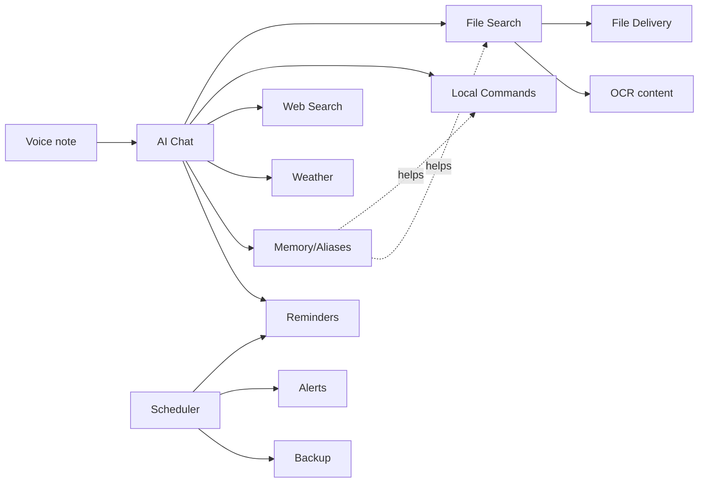

# Feature Guide (Part 5)

Every feature explained the same way: **what it does · how it works inside · how you
use it · examples · hidden capabilities · limitations · best practices · common
mistakes.**

---

## 1. AI Chat

**What:** General question answering in English, Hindi, or Hinglish.
**How it works inside:** Your message → agent → Groq (or Gemini) → reply. If the
question might relate to your files, the AI first calls `search_files`. Streaming
edits the reply into the chat as it's generated.
**How you use it:** Just talk. "explain what a webhook is in 2 lines."
**Examples:** "summarize the theory of relativity", "mujhe ek motivational quote do"
**Hidden capabilities:** It remembers the last 24 messages, so follow-ups work:
"...now make it shorter."
**Limitations:** The AI's own knowledge has a training cutoff — for current events
it needs `web_search`.
**Best practice:** Be specific. "in 3 bullet points" or "in Hindi" steers it.
**Common mistake:** Expecting it to know today's news without asking it to search.

---

## 2. Intelligent File Search

**What:** Find files across Desktop, Documents, Downloads, Pictures, etc. by
filename, content, or **meaning**.
**How it works inside:** `FileSearch.search()` runs fuzzy filename matching
(rapidfuzz) + semantic search (ChromaDB embeddings), merges them, boosts recent
files, returns the top 8. See [WORKFLOW.md](WORKFLOW.md).
**How you use it:** "find my resume", "us project ko dhundo jisme telegram
notifications banaye the"
**Examples:**
- "find the invoice from last month"
- "which file has my aws keys" (⚠️ then consider rotating them)
**Hidden capabilities:** Searches file *contents*, not just names — a file named
`untitled.pdf` about taxes is found by searching "tax".
**Limitations:** Only indexes the folders in `INDEX_DIRS`, files under the size
limit (`MAX_FILE_SIZE_MB`, default 25MB), and supported types. Semantic quality is
English-leaning.
**Best practice:** Describe the *content* if you forget the name.
**Common mistake:** Searching a folder that isn't in `INDEX_DIRS` (add it in `.env`).

---

## 3. File Delivery

**What:** The bot sends matching files straight to your Telegram chat.
**How it works inside:** The `send_file` tool validates the path (must exist, under
50MB — Telegram's bot limit) and queues it; the bot uploads via `sendDocument`.
**How you use it:** "send me my resume", "email jo pdf kal banaya tha wo bhejo"
**Limitations:** 50MB max (Telegram bot limit). Files must be under your home dir.
**Best practice:** If several match, the bot lists them — reply with which one.

---

## 4. OCR (screenshot text search)

**What:** Reads text *out of images/screenshots* so you can search them.
**How it works inside:** During indexing, images go through Tesseract (`eng+hin`);
the extracted text is embedded like any document. See
[TECH_STACK.md](TECH_STACK.md#tesseract-ocr).
**How you use it:** "find the screenshot where docker failed", "wo screenshot dhundo
jisme error tha"
**Hidden capabilities:** Works on Hindi text in images too.
**Limitations:** Accuracy depends on image clarity; needs `brew install tesseract`.
Images with no readable text are indexed by filename only.
**Best practice:** After installing Tesseract or adding many screenshots, send
`/reindex`.
**Common mistake:** Expecting instant results for a *just-taken* screenshot — give
the indexer a few seconds (it reacts live via watchdog).

---

## 5. Voice Notes

**What:** Send a voice note; Kukku transcribes it and treats it as a text message.
**How it works inside:** `on_voice()` downloads the audio → `Transcriber` (Whisper
`small`, local) → text → same path as a typed message. Language auto-detected.
**How you use it:** Hold the mic in Telegram, speak (English/Hindi/Hinglish), send.
**Limitations:** First voice note after a restart downloads the model (~1 min once);
later ones take a few seconds. Needs `ffmpeg`.
**Best practice:** Speak clearly; background noise hurts accuracy.
**Common mistake:** Thinking it's broken during the first slow transcription.

---

## 6. Local Mac Commands

**What:** Control your Mac: open apps/files/folders, clipboard, lock, sleep,
shutdown/restart.
**How it works inside:** The `run_local_command` tool calls `local_commands.execute`
which only runs allowlisted actions. Destructive ones need confirmation.
**How you use it:** "open chrome", "lock my screen", "open my downloads folder",
"what's on my clipboard", "copy 'hello' to clipboard"
**Full action list:** `open_vscode`, `open_chrome`, `open_folder`, `open_file`,
`open_app`, `read_clipboard`, `copy_to_clipboard`, `lock_screen`, `sleep`,
`shutdown`, `restart`.
**Hidden capabilities:** "open the nova project in vscode" resolves via aliases +
home-relative paths.
**Limitations:** Paths must be under your home folder (safety). macOS may prompt for
Automation permission the first time.
**Best practice:** Set aliases for projects: "remember my nova project is ~/nova".
**Common mistake:** Expecting arbitrary shell — the AI *cannot* run raw commands,
only the fixed menu. This is a deliberate safety wall.

---

## 7. Internet Search

**What:** Answers questions needing current/live info.
**How it works inside:** `web_search` tries **Gemini Google-Search grounding** first
(real Google results), falls back to DuckDuckGo scraping.
**How you use it:** "who won the last cricket world cup", "aaj ka gold rate kya hai"
**Limitations:** Uses one Gemini call per search (counts toward its quota).
**Best practice:** Only ask to "search" when you truly need current info; general
knowledge doesn't need it.

---

## 8. Weather

**What:** Current weather + today's high/low for any city.
**How it works inside:** `get_weather` → Open-Meteo (free, no key). Zero AI cost for
the data itself.
**How you use it:** "delhi ka weather", "what's the weather in London"
**Limitations:** Current + today only (not a multi-day forecast — easy to extend).

---

## 9. Memory & Aliases

**What:** Remembers facts and shortcuts across conversations.
**How it works inside:** `save_memory` → `memories` table; `set_alias` → `aliases`
table. Both are injected into the system prompt every turn.
**How you use it:** "remember that my office wifi password is X", "set alias: my cv =
~/Documents/cv.pdf"
**Hidden capabilities:** Aliases make commands shorter — "open my cv" just works.
**Limitations:** Memories are plain text in SQLite (not encrypted — see
[SECURITY.md](SECURITY.md)).
**Best practice:** Use `/memory` to review; don't store passwords you care about.
**Common mistake:** Storing sensitive secrets in memory (it's readable in the DB).

---

## 10. Reminders

**What:** One-time and daily reminders the bot pushes to you.
**How it works inside:** `set_reminder` stores a row in `reminders`; the
`Scheduler` fires due ones every 30s and reschedules daily ones. **Zero AI cost** to
fire. The AI computes the time from the current time in the prompt.
**How you use it:** "remind me at 5pm to call mom", "har roz subah 8 baje standup
yaad dilana", "mere reminders dikhao", "cancel reminder 3"
**Limitations:** Only fires while Kukku is running (your Mac must be on).
**Best practice:** Use daily reminders for routines.
**Common mistake:** Setting a reminder then shutting the Mac down before it fires.

---

## 11. Proactive Alerts

**What:** Warns you about low battery or near-full disk before it's a problem.
**How it works inside:** The `Scheduler` monitor loop checks psutil every 10 min,
with hysteresis so it doesn't spam. Sends to your `owner_chat_id`.
**How you use it:** Nothing — it's automatic. Tune thresholds in `.env`
(`ALERT_BATTERY_PCT`, `ALERT_DISK_PCT`).
**Limitations:** Battery alert only on laptops (needs a battery).

---

## 12. Auto-Backup

**What:** Daily consistent backup of your database (memories, history, reminders,
file index).
**How it works inside:** `Scheduler` calls `db.backup()` (WAL-safe SQLite backup)
once per day into `data/backups/`, keeping the last 7.
**How you use it:** Nothing — automatic. Restore by copying a backup over
`data/jarvis.db` (with Kukku stopped).

---

## 13. Always-Online Cloud Relay

**What:** Answers general questions even when your Mac is off/asleep.
**How it works inside:** Telegram → Cloudflare Worker. If the Mac is long-polling,
it's forwarded; if not, the Worker answers via Gemini→Groq with a "💤 Mac offline"
note. See [ARCHITECTURE.md](ARCHITECTURE.md).
**Limitations:** Offline mode can't touch files or run commands (the Mac is off).
**Best practice:** Leave the Mac plugged in + awake for full features.

---

## 14. Admin Dashboard

**What:** A local web page showing system status, indexed files, searches, logs,
memory, and the active AI provider.
**How you use it:** Open `http://127.0.0.1:8788` on the Mac.
**Limitations:** Local-only (binds 127.0.0.1) because it exposes file paths.

---

## 15. Security (owner-only)

**What:** Only your Telegram account can use the bot; everyone else is rejected and
logged.
**How it works inside:** `ALLOWED_USER_IDS` checked at both the Worker and the Mac.
See [SECURITY.md](SECURITY.md).

---

## Feature interaction map

Next: [USAGE_GUIDE.md](USAGE_GUIDE.md) for hundreds of example commands.
