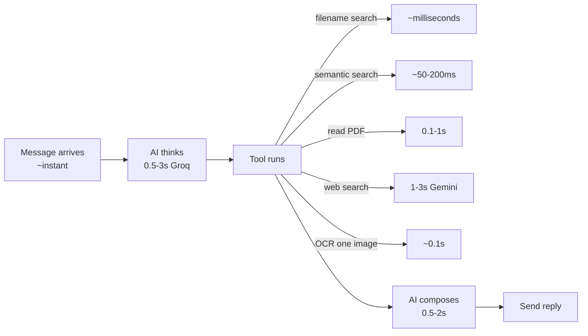
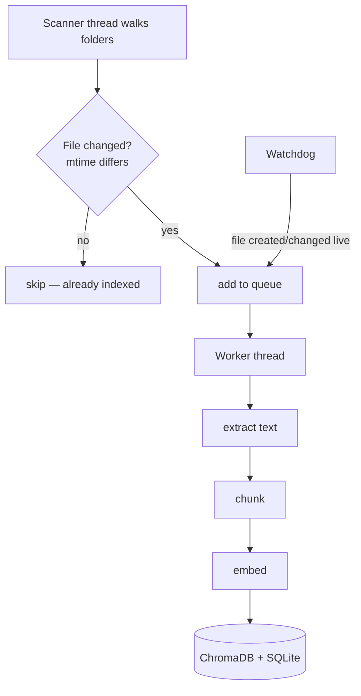

# Performance (Part 11)

What's fast, what's slow, what's cached, how indexing and memory scale, and how to
tune it.

---

## Where time goes (per message)

**The AI calls dominate.** File search, embeddings, and OCR are fast; the latency
you feel is mostly the LLM round-trips (1–3 of them per message). Groq is chosen
partly *because* it's very fast.

---

## What's slow (and why it's OK)

| Operation | Time | Why | Mitigation |
|---|---|---|---|
| First voice note after restart | ~1 min | Downloads + loads Whisper model | One-time; then cached in memory |
| First semantic search after restart | ~5–30s | Loads the embedding model | One-time (lazy load) |
| Initial full index of thousands of files | minutes | Reads + embeds every file | Background; bot works meanwhile |
| OCR of a huge image | ~0.5s | Tesseract processing | Rare; size-limited |
| Web search | 1–3s | Network + Gemini | Only when needed |

None of these block the bot — heavy work runs in **threads** or the **background**.

---

## What's cached

| Cache | Where | TTL | Effect |
|---|---|---|---|
| **Search results** | `FileSearch._cache` | 60s | Repeat searches are instant |
| **Embedding model** | loaded once in memory | until restart | No reload per search |
| **Whisper model** | loaded once | until restart | Fast repeat transcriptions |
| **Provider cooldowns** | `FailoverProvider` | 60–90s | Skips a rate-limited provider |
| **mtime skip** | `indexed_files.mtime` | persistent | Unchanged files aren't re-indexed |

---

## How indexing scales

- **Incremental:** only new/changed files (by modification time) are processed. A
  rescan of an unchanged 3,000-file folder does almost no work.
- **Skips the junk:** `node_modules`, `.git`, `Library`, bundles, dotfiles, and
  files over `MAX_FILE_SIZE_MB` are ignored.
- **Live + periodic:** watchdog reacts instantly; a full rescan runs every
  `RESCAN_INTERVAL_MIN` (default 60) as a safety net.

**Scale reality:** thousands of files → tens of thousands of vectors → a few
hundred MB of ChromaDB. Search stays sub-second because vector databases are built
for nearest-neighbor lookups.

---

## How memory grows

See [DATABASE.md](DATABASE.md#how-data-grows-over-time). Summary: everything is
small and mostly bounded. The only real grower is ChromaDB (proportional to how
much file *content* you have), and even that is modest at personal scale. Logs and
backups are capped by rotation.

**If the DB ever feels bloated:** `/clear` old conversations, or rebuild the index
(see [RECOVERY.md](RECOVERY.md)).

---

## How searches stay fast

1. **Filename search** hits an indexed SQLite column (`idx_files_name`) — instant.
2. **Semantic search** uses ChromaDB's HNSW index (approximate nearest-neighbor) —
   sub-200ms even over tens of thousands of vectors.
3. **Result caching** makes repeats instant for 60s.
4. **Best-chunk-per-file** dedup keeps result sets small.

---

## Tuning knobs (`.env`)

| Setting | Default | Trade-off |
|---|---|---|
| `WHISPER_MODEL` | `small` | `base` = faster but bad Hindi; `medium` = best but slow + more RAM |
| `MAX_FILE_SIZE_MB` | 25 | Higher indexes bigger files but slower + more storage |
| `RESCAN_INTERVAL_MIN` | 60 | Lower = fresher index, more CPU |
| `MONITOR_INTERVAL_MIN` | 10 | How often battery/disk are checked |
| `LLM_PRIORITY` | groq,gemini,... | Put the faster/more-generous provider first |
| `embedding_model` | MiniLM-L6 | A bigger model = better semantics, slower + more RAM |

---

## RAM budget (your 16GB Mac)

| Component | Approx RAM |
|---|---|
| Python + libraries | ~300–500MB |
| Embedding model (MiniLM) | ~200MB |
| Whisper `small` (when loaded) | ~500MB–1GB |
| ChromaDB | ~100–300MB |
| **Total Kukku footprint** | **~1–2GB** |

This is why **Ollama was deliberately not added** — a local LLM would add several
GB of constant RAM use and slow your Mac. Kukku stays light by using *cloud* LLMs
(Groq/Gemini) for thinking and *small local* models only for voice/embeddings.

---

## Optimization checklist

- [ ] Keep `INDEX_DIRS` to folders you actually search (don't index everything).
- [ ] Leave `WHISPER_MODEL=small` unless you need `medium` accuracy.
- [ ] Let the first-use model loads happen once; don't restart needlessly.
- [ ] If search feels stale, `/reindex`; if bloated, rebuild the index.
- [ ] Keep Groq primary (fast + generous) via `LLM_PRIORITY`.

Next: [EXTENDING.md](EXTENDING.md) or [TROUBLESHOOTING.md](TROUBLESHOOTING.md).
