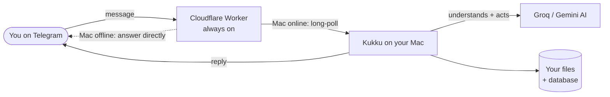

# Kukku — Engineering Documentation

Welcome. This is the complete engineering manual for **Kukku**, your Personal AI
Telegram Assistant. It is written for someone who owns the project but did not
write most of the code — so nothing is assumed. Read it top to bottom once, then
use it as a reference.

> **How to read this:** Start with [ARCHITECTURE](ARCHITECTURE.md) to see the big
> picture, then [WORKFLOW](WORKFLOW.md) to follow one message through the whole
> system. After that, dip into whichever topic you need.

---

## What Kukku is (in one paragraph)

Kukku is a program that runs on your Mac 24/7. You talk to it through a Telegram
chat. When you send a message, Kukku uses an AI model (Groq or Gemini — both
free) to understand what you want, and then it can **do things**: search the files
on your laptop by meaning (not just filename), read documents, send files back to
you, run safe Mac commands (open apps, lock screen), search the web, remember
notes, set reminders, tell you the weather, and transcribe your voice notes — in
English, Hindi, or Hinglish. When your Mac is off, a small always-on cloud program
still answers your general questions.

---

## The documentation set

| Doc | What it covers | Which "Part" of your brief |
|---|---|---|
| [ARCHITECTURE.md](ARCHITECTURE.md) | The big picture, every component, why it exists, the dependency map | Part 1, Part 13 |
| [PROJECT_STRUCTURE.md](PROJECT_STRUCTURE.md) | Every folder and file, what to edit, what never to touch | Part 2 |
| [WORKFLOW.md](WORKFLOW.md) | "Find my resume" traced through every single step | Part 3 |
| [TECH_STACK.md](TECH_STACK.md) | Every technology: why chosen, pros/cons, how it works | Part 4 |
| [FEATURES.md](FEATURES.md) | Every feature: internals, usage, limits, best practices | Part 5 |
| [USAGE_GUIDE.md](USAGE_GUIDE.md) | Hundreds of example commands + daily workflows | Part 6 |
| [AI_ARCHITECTURE.md](AI_ARCHITECTURE.md) | How the AI, tools, memory, embeddings, RAG work | Part 7 |
| [API_REFERENCE.md](API_REFERENCE.md) | Dashboard API, agent tools, worker endpoints | — |
| [DATABASE.md](DATABASE.md) | SQLite tables, ChromaDB, where everything lives | Part 9 |
| [SECURITY.md](SECURITY.md) | Secrets, auth, webhook validation, vulnerabilities | Part 8 |
| [PERFORMANCE.md](PERFORMANCE.md) | What's slow, what's cached, how to optimize | Part 11 |
| [EXTENDING.md](EXTENDING.md) | How to safely add Gmail, Calendar, plugins, etc. | Part 12 |
| [TROUBLESHOOTING.md](TROUBLESHOOTING.md) | Every problem: symptoms, causes, fixes | Part 10 |
| [ROADMAP.md](ROADMAP.md) | Honest self-review + v1→v5 roadmap | Part 14, Part 15 |
| [GLOSSARY.md](GLOSSARY.md) | Every technical term, defined simply | — |
| [FAQ.md](FAQ.md) | Quick answers to common questions | — |
| [INSTALL.md](INSTALL.md) | First-time setup | — |
| [RECOVERY.md](RECOVERY.md) | Restart, reindex, rotate keys, migrate | — |

---

## The 30-second mental model

Three things to hold in your head:

1. **The AI is the brain, but it has no hands.** The AI decides *what* to do; the
   Python code on your Mac actually does it (searches files, runs commands). This
   is called **tool calling** and it's the heart of the system.
2. **Your Mac does the real work.** File search, commands, voice — all local. The
   cloud part is just a reliable "mailbox" so Telegram can reach your Mac.
3. **Everything is free.** Groq + Gemini free tiers for AI, Cloudflare free tier
   for the relay, local models for voice/search. No paid services.

---

## Conventions used in these docs

- **`code font`** = a real file, function, command, or setting you can find.
- **Mermaid diagrams** render automatically on GitHub, VS Code (with the Mermaid
  extension), and most Markdown viewers. If you see a raw code block labelled
  *mermaid* as plain text, open the file in a viewer that supports Mermaid.
- 🟢 = safe to edit, 🟡 = edit carefully, 🔴 = do not edit unless you fully understand it.
