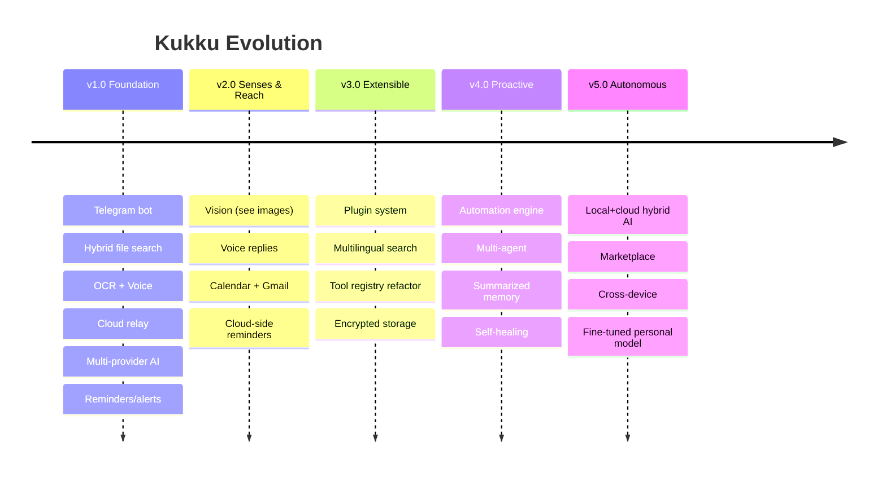
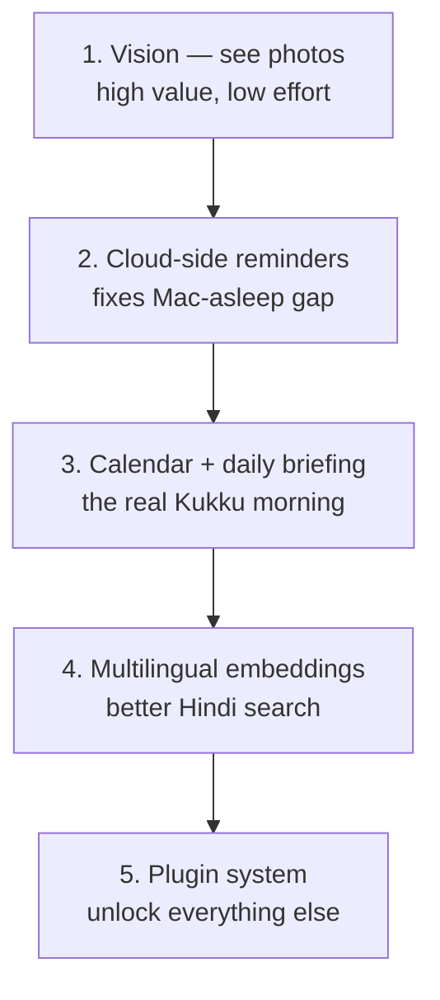

# Self-Review & Roadmap (Part 14 & Part 15)

An honest critique of the current system, then a version-by-version roadmap from
v1.0 (today) to v5.0.

---

## Part 14 — Honest self-review

I built this. Here's where it's genuinely good, where it's weak, and what I'd
redesign.

### ✅ Good architecture

| What | Why it's good |
|---|---|
| **Layered design** | Clean flow: bot → agent → tools → db. No circular dependencies. Easy to test and reason about. |
| **Provider abstraction** | One `OpenAICompatProvider` covers 4 providers; adding one is trivial. Failover is transparent. |
| **Long-poll transport** | Outbound-only, no tunnel to die. This was the single biggest reliability win (replaced fragile cloudflared). |
| **Lazy loading** | The app boots instantly and survives missing optional deps. |
| **Allowlist security** | The AI physically cannot run arbitrary commands. Bounded blast radius. |
| **Local-first compute** | Voice, OCR, embeddings all local and free; only "thinking" uses cloud AI. Keeps it cheap and private. |
| **Everything tested** | 161 tests, mocked external calls, fast suite. Refactors are safe. |
| **Graceful degradation** | Missing Tesseract? Files indexed by name. Rate-limited? Failover. Mac off? Cloud answers. |

### ⚠️ Bad / weak architecture

| What | Why it's weak | Severity |
|---|---|---|
| **Single SQLite connection + lock** | Fine for one user, but serializes all DB access. Wouldn't scale to multi-user. | Low (by design) |
| **English-centric embeddings** | `all-MiniLM-L6-v2` searches Hindi *content* poorly. A multilingual model would be better. | Medium |
| **Groq tool-calling is quirky** | Needs the text-parse + empty-retry workarounds. Fragile if Groq changes formats. | Medium |
| **No conversation summarization** | History is a flat last-24; long contexts get truncated bluntly instead of summarized. | Low |
| **Agent is one big file** | `agent.py` holds tools + dispatch + prompt. Fine now, will get unwieldy as tools grow. | Low |
| **Reminders die if Mac is off** | The scheduler only runs on the Mac; a reminder at 3am with the Mac asleep is missed. | Medium |
| **No encryption at rest** | `data/` and `.env` are plaintext (rely on FileVault). | Low–Med |

### 🧹 Technical debt

- `agent.py` should be split: tool *definitions*, tool *dispatch*, and the *loop*
  into separate modules once there are ~20 tools.
- The dashboard HTML is one growing file; a tiny build step or component split
  would help past a certain size.
- Provider-specific quirks (Groq text tool-calls) leak into the generic
  `OpenAICompatProvider`; could be isolated into a Groq subclass.
- Some config values (chunk size, history limit, cooldowns) are constants in code;
  could be config fields.

### 🐛 Possible bugs / edge cases

- **Clock/timezone for reminders:** reminders use local time from the prompt; if
  the Mac's timezone changes (travel), a pending reminder's absolute time is fixed
  at creation — usually desired, but worth knowing.
- **ChromaDB / SQLite drift:** if a crash happens mid-index, `indexed_files.chunks`
  could disagree with ChromaDB. A rebuild fixes it; no auto-reconciliation yet.
- **Very large files near the limit** could be slow to extract on the worker
  thread (bounded by `MAX_FILE_SIZE_MB`).
- **Duplicate reminders** if you phrase the same reminder twice (no dedup).

### 🔁 What I'd redesign with hindsight

1. **Move the scheduler off the Mac** for reminders — fire them from the always-on
   Cloudflare Worker (via Cron Triggers) so they work even when the Mac sleeps.
2. **Multilingual embeddings** from day one for true Hindi content search.
3. **A proper tool registry** (decorator-based) instead of the manual `TOOLS` list
   + `if/elif` dispatch.
4. **Structured conversation memory** (summarize old turns) instead of a flat
   window.

---

## Part 15 — Roadmap: v1.0 → v5.0

### v1.0 — Foundation ✅ (shipped — this is where you are)
Telegram bot, streaming, auth · hybrid semantic file search · OCR (eng+hin) ·
voice (Whisper) · file delivery · allowlisted commands · web search (Gemini
grounding) · memory/aliases · reminders + system alerts + weather + backup ·
Groq→Gemini failover · always-online cloud relay · dashboard · 161 tests.

### v2.0 — Senses & Reach
- **Vision:** send a photo → Gemini describes/answers (multimodal). *High value,
  low effort.*
- **Voice replies (TTS):** bot answers with voice notes (Hindi/English).
- **Calendar integration:** "what's today", feed events into the daily briefing.
- **Gmail integration:** "any important unread?"
- **Cloud-side reminders:** fire from the Worker (Cron Triggers) so they work with
  the Mac asleep. *Fixes the biggest current gap.*
- **Security:** encrypt the memory DB; guided credential rotation.

### v3.0 — Extensible
- **Plugin system:** drop a file in `plugins/`, it becomes a tool. Community-style.
- **Tool registry refactor:** decorator-registered tools, split `agent.py`.
- **Multilingual embeddings:** true Hindi content search.
- **Encrypted storage** at rest; secrets in the macOS Keychain.
- **Performance:** parallel indexing, smarter chunking.

### v4.0 — Proactive
- **Automation engine:** "when X, do Y" rules (file added → index + notify;
  keyword in new screenshot → alert).
- **Multi-agent:** a planner agent that delegates to specialist sub-agents
  (search-agent, code-agent, comms-agent) for complex requests.
- **Summarized memory:** compress old conversation into durable summaries instead
  of a flat window.
- **Self-healing:** auto-reconcile SQLite↔ChromaDB drift; auto-rotate on quota.

### v5.0 — Autonomous
- **Hybrid local+cloud AI:** small local model for private/simple tasks, cloud for
  hard ones — routed automatically (RAM permitting, or on a beefier machine).
- **Plugin marketplace:** share/install community tools safely (sandboxed).
- **Cross-device:** run on multiple machines, unified memory.
- **Fine-tuned personal model:** a model adapted to your files, style, and habits.
- **Offline AI mode:** full functionality without any cloud provider.

---

## Prioritized "next 5 things" (my recommendation)

1. **Vision** — you already send photos; make the bot *see* them. Biggest
   capability jump for the least work.
2. **Cloud-side reminders** — the one gap that undermines "reliable" (reminders
   miss when the Mac sleeps).
3. **Calendar + daily briefing** — completes the proactive "morning assistant".
4. **Multilingual embeddings** — you use Hindi; make Hindi *content* searchable.
5. **Plugin system** — turns every future idea into a drop-in file.

Each is free or near-free and fits the existing architecture. See
[EXTENDING.md](EXTENDING.md) for exactly where the code goes.
