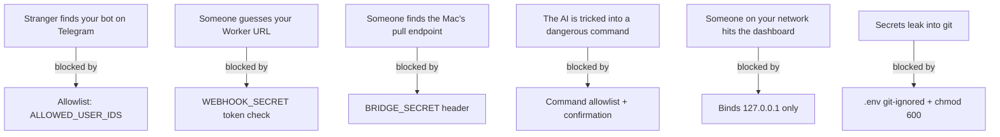
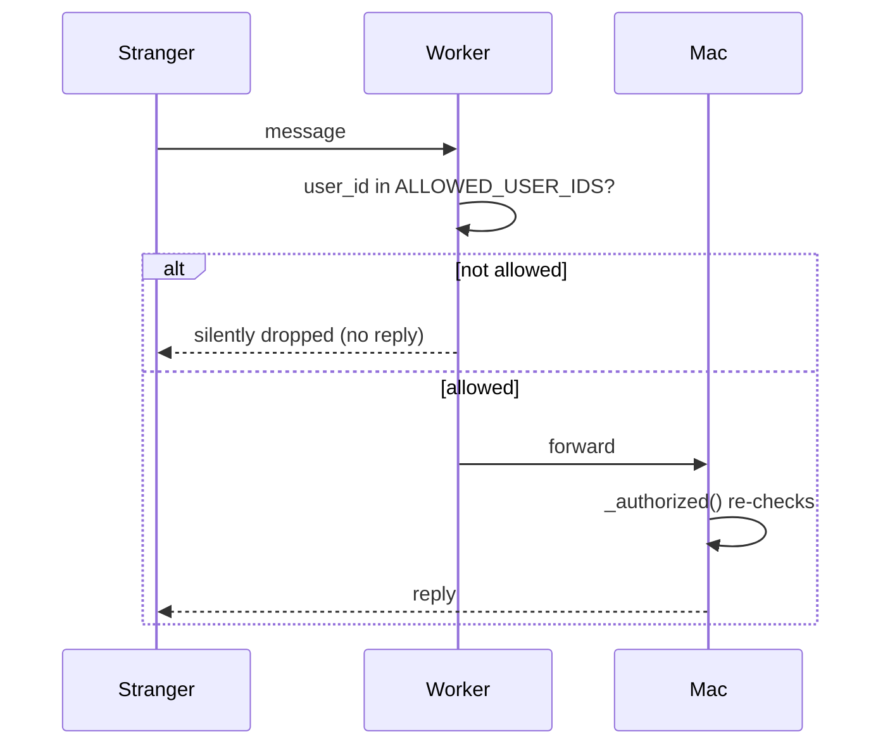
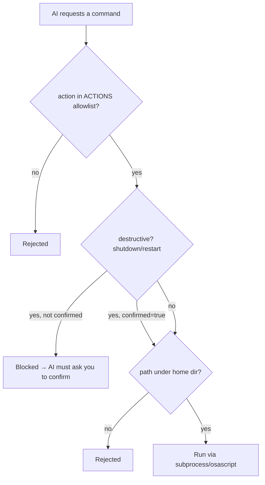

# Security (Part 8)

How Kukku protects itself, what the threats are, and how to harden it. Read this
fully — you're running a program that can read your files and control your Mac.

---

## The threat model (who could attack, and how)

Kukku is designed for **one user (you)**. Every layer assumes strangers must be
kept out.

---

## 1. Secrets & API keys

**What secrets exist:**
| Secret | What it unlocks | Where stored |
|---|---|---|
| `TELEGRAM_BOT_TOKEN` | Full control of your bot | `.env` (Mac) + Worker secret |
| `GEMINI_API_KEY` | Your Gemini quota | `.env` + Worker secret |
| `GROQ_API_KEY` | Your Groq quota | `.env` + Worker secret |
| `BRIDGE_SECRET` | Authorizes Mac↔Worker | `.env` + Worker secret |
| `WEBHOOK_SECRET` | Authorizes Telegram→Worker | `.env` + Worker secret |

**How they're protected:**
- `.env` is **git-ignored** (never committed) and set to `chmod 600` (only you can
  read it).
- On Cloudflare, secrets are stored via `wrangler secret put` — encrypted, never in
  the code or `wrangler.toml`.
- Verified: **zero secrets in git history** (checked across all commits).

**Best practices:**
- Rotate any key that has ever appeared in a chat/screenshot (BotFather for the
  token, the provider consoles for keys). See [RECOVERY.md](RECOVERY.md#rotate-credentials).
- Never paste `.env` contents into a chat or issue.

---

## 2. Authentication (who can use the bot)

Two independent checks, both on `ALLOWED_USER_IDS`:

**Defense in depth:** even if someone bypassed the Worker, the Mac re-checks in
`JarvisBot._authorized()`. Rejected attempts are logged to `request_log` with
`kind='denied'`, visible on the dashboard.

**Bootstrap safety:** with `ALLOWED_USER_IDS` empty, the bot replies with the
sender's ID (so you can allowlist yourself) but does nothing else.

---

## 3. Telegram security

- **Bot token = full control.** Anyone with it can send/receive as your bot. Keep
  it secret; rotate via @BotFather if exposed.
- **Chat ID = user ID** in private chats — that's why `owner_chat_id` (for alerts)
  is derived from the allowlist.
- Telegram traffic is HTTPS end-to-end between Telegram and your Worker/Mac.

---

## 4. Cloudflare / webhook security

- **Webhook secret token:** When the webhook is set (`setup_cloud.sh`), Telegram is
  given a secret. It sends that secret in the `x-telegram-bot-api-secret-token`
  header on every call. The Worker rejects anything without the exact match
  (HTTP 401). This stops URL-guessing attacks.
- **Bridge secret:** The Mac's `/pull` requests carry `x-bridge-secret`. The Worker
  rejects mismatches (401). So even if someone finds the Worker, they can't drain
  your message queue.
- **Durable Object isolation:** The mailbox is keyed to a single instance; there's
  no public way to inject into it except through the authenticated `/webhook`.

---

## 5. Command execution safety

This is the most important safety wall. **The AI can never run arbitrary shell.**

- **Allowlist only:** `local_commands.ACTIONS` is a fixed menu (open apps, lock,
  clipboard, etc.). Anything else is rejected.
- **No shell interpolation:** commands run as argument lists (`["open", "-a",
  name]`), not shell strings — so no injection via crafted filenames.
- **Path confinement:** file/folder targets must resolve under `$HOME`.
- **Confirmation gate:** `shutdown`/`restart` return "BLOCKED" unless the AI passes
  `confirmed=true`, which the prompt only allows after you explicitly say yes.

---

## 6. Dashboard security

- Binds to **127.0.0.1** (localhost) only — not reachable from other devices on
  your network or the internet. It exposes file paths and logs, so this is
  deliberate.
- No auth on it *because* it's local-only. **Do not** change `DASHBOARD_HOST` to
  `0.0.0.0` without adding authentication first.

---

## 7. Data privacy

- **Your files never leave your Mac** for search/OCR/voice — those run locally.
- **What does leave:** the text of your *messages* and any file content the AI
  *reads* (`read_file`) goes to the AI provider (Groq/Gemini) to generate the
  answer. That's inherent to using a cloud LLM. If a file is sensitive, don't ask
  the AI to read it.
- **Memories are plaintext** in SQLite — don't store real passwords there.
- **OCR caveat:** if you screenshot something secret (like DB credentials), OCR
  puts that text into your local index. It stays local, but it's searchable.

---

## 8. Known limitations / potential vulnerabilities

| Risk | Severity | Mitigation |
|---|---|---|
| Secrets in `.env` readable by any process running as you | Medium | Inherent to local apps; keep your Mac account secure |
| Memories/DB unencrypted at rest | Low–Med | Don't store secrets; use FileVault (macOS disk encryption) |
| AI reads a sensitive file when asked | Low | You control what you ask it to read |
| Dashboard has no auth | Low | Local-only binding; don't expose it |
| Prompt injection via file contents | Low | A malicious file could try to influence the AI, but commands are allowlisted so damage is bounded |
| Bot token/keys were pasted in chat during setup | Medium | **Rotate them** (recommended) |

---

## 9. How to harden further

1. **Rotate the credentials** that passed through any chat (token, Gemini, Groq).
2. **Enable FileVault** (macOS full-disk encryption) so `data/` and `.env` are
   encrypted at rest.
3. **Keep `ALLOWED_USER_IDS` tight** — only your ID(s).
4. **Never expose the dashboard** (`DASHBOARD_HOST=127.0.0.1`).
5. **Review the request log** on the dashboard occasionally for `denied` entries.
6. **Back up `.env`** securely (it's not in the DB backups).
7. If you add tools that run commands or send data out, keep the **allowlist +
   confirmation** pattern.

---

## Security checklist

- [ ] `.env` is git-ignored and `chmod 600`
- [ ] `ALLOWED_USER_IDS` contains only your ID
- [ ] Credentials that leaked into chats are rotated
- [ ] Dashboard bound to 127.0.0.1
- [ ] FileVault on (recommended)
- [ ] No secrets stored in `memories`
- [ ] Any credential that ever passed through a chat or log is rotated

---

## Reporting a Vulnerability

If you discover a security vulnerability in Kukku, please report it
**privately** — do not open a public GitHub issue.

- Use GitHub's [private vulnerability reporting](https://docs.github.com/en/code-security/security-advisories/guidance-on-reporting-and-writing-information-about-vulnerabilities/privately-reporting-a-security-vulnerability)
  ("Report a vulnerability" under the repository's **Security** tab), or
- Contact the maintainer through the address on their GitHub profile.

Please include steps to reproduce and the affected component. You can expect an
acknowledgement within a few days. Because Kukku is designed to be self-hosted
by a single user, most runtime hardening is the operator's responsibility — see
the threat model and checklist above.

Next: [TROUBLESHOOTING.md](TROUBLESHOOTING.md) or [PERFORMANCE.md](PERFORMANCE.md).
