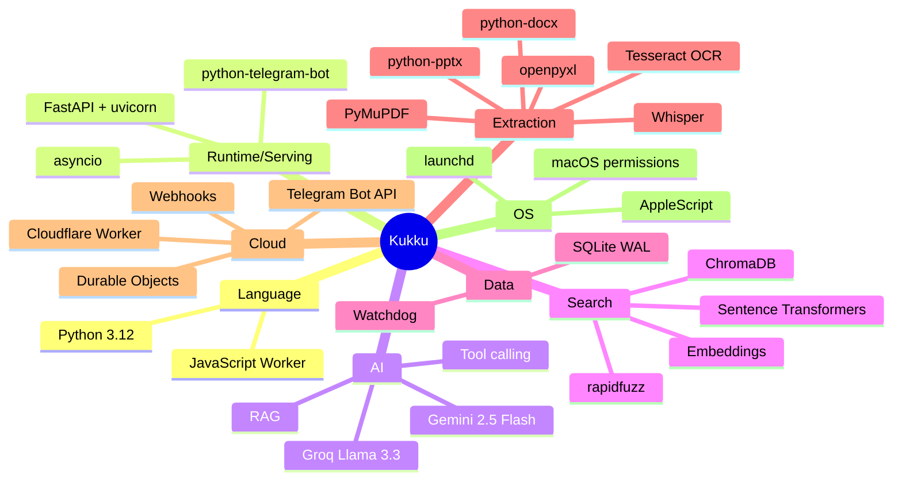
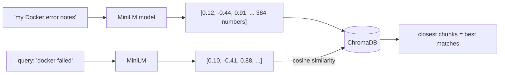

# Technology Stack (Part 4)

Every technology in Kukku, explained from scratch: **what it is, why it was
chosen, its pros/cons, where it's used, and how it works.** Read the ones you're
curious about; skip the rest.

---

## Quick map: technology → where it's used

---

## Core language & runtime

### Python 3.12
**What:** The main programming language. Everything on your Mac is Python.
**Why chosen:** The AI/ML ecosystem (embeddings, Whisper, PDF parsing) is
Python-first. `asyncio` gives us concurrency without threads-everywhere.
**Pros:** Huge library ecosystem, readable, fast to build with.
**Cons:** Slower than Go/Rust for raw compute (irrelevant here — the heavy work is
in C-backed libraries). The GIL limits true multi-threading (worked around with
process-level tools + async).
**Where:** All of `app/`.

### asyncio (built into Python)
**What:** Python's system for doing many things "at once" on a single thread by
letting tasks pause (`await`) while waiting for I/O.
**Why chosen:** The bot, the bridge, the scheduler, and the dashboard all need to
run simultaneously without blocking each other. Async does this without the
complexity of many threads.
**How it works:** One "event loop" runs tasks. When a task hits `await
something_slow()`, it yields control so another task can run, and resumes when the
slow thing is done. **Rule:** never do blocking work (like reading a 50MB PDF)
directly in async code — push it to a thread with `run_in_executor`, which Kukku
does everywhere.
**Where:** `main.py`, `agent.py`, `bridge.py`, `scheduler.py`, `telegram_bot.py`.

---

## Serving & bot layer

### python-telegram-bot (v21)
**What:** A Python library that wraps the Telegram Bot API.
**Why chosen:** Mature, async-native, handles the fiddly bits (file downloads,
message editing, chat actions) so we don't hand-roll HTTP calls.
**Pros:** Robust, well-documented, handles rate limits.
**Cons:** Large-ish; its `Application` object is opinionated (we bend it slightly to
feed updates from the bridge instead of its own poller).
**Where:** `app/bot/telegram_bot.py`.
**How it works:** You register "handlers" for message types; when an update
arrives, the matching handler runs. We feed updates in via `update_queue.put()`
from the bridge.

### FastAPI + uvicorn
**What:** FastAPI is a web framework for building APIs; uvicorn is the server that
runs it.
**Why chosen:** The dashboard needs a small JSON API + a static page. FastAPI is
async (fits our event loop), fast, and needs almost no boilerplate.
**Pros:** Auto-generates API docs (`/api/docs`), type-validated, async.
**Cons:** Overkill if you only ever need one endpoint (but we have several).
**Where:** `app/dashboard/api.py`. Runs *inside the same event loop* as the bot.

### Telegram Bot API + Webhooks
**What:** Telegram's HTTP API for bots. A **webhook** is a URL Telegram calls when
your bot gets a message (vs. **polling**, where your bot repeatedly asks).
**Why webhook here:** So the always-on Cloudflare Worker can receive messages even
when your Mac is off. (In pure local mode without the cloud relay, Kukku uses
polling instead.)
**Where:** Webhook is set by `scripts/setup_cloud.sh`; handled by `cloud/worker.js`.

---

## The AI layer

### Google Gemini 2.5 Flash
**What:** Google's fast, multimodal LLM. Used via its OpenAI-compatible API.
**Why chosen:** Free tier with no credit card, genuinely smart, **multimodal**
(understands images), and has **Google Search grounding** built in (real, current
web results). Used as the fallback provider and for web search.
**Pros:** Free, smart, current-events via grounding, multilingual (great Hindi).
**Cons:** Small free quota (~20 requests/*minute*, few hundred/day). Occasionally
rate-limits under bursts.
**Where:** `app/core/llm.py` (as a provider), `app/tools/web_search.py` (grounding).

### Groq (Llama 3.3 70B)
**What:** Groq is a company that runs open models (like Meta's Llama 3.3 70B) on
custom chips, *extremely* fast. Used via its OpenAI-compatible API.
**Why chosen:** Its free tier is far more generous than Gemini's, and it's very
fast. Made the **primary** provider so Gemini's small quota stays in reserve.
**Pros:** Free, blazing fast, generous limits.
**Cons:** Llama 3.3 is slightly less capable than Gemini; its tool-calling is
quirky — it sometimes emits tool calls as *text* and sometimes returns empty
responses. Kukku handles both (see `llm.py`: `_extract_text_tool_calls`,
`EmptyResponseError`, `temperature: 0`).
**Where:** `app/core/llm.py`.

### OpenAI-compatible API (the pattern, not the company)
**What:** A de-facto standard HTTP shape for chat APIs (`POST /chat/completions`
with `messages` and `tools`). Gemini, Groq, OpenRouter, and Ollama all speak it.
**Why it matters:** One class — `OpenAICompatProvider` — works for *all* of them.
Adding a new provider is just a new base URL + key. This is why Kukku is
provider-agnostic.

### Tool calling (function calling)
**What:** A feature where the LLM, instead of replying with text, replies with a
structured request to run a named function with arguments.
**Why it's the heart of Kukku:** It's how the "brain" (AI) gets "hands" (your
code). The AI says "call `search_files('resume')`"; your code runs it and reports
back.
**Where:** Defined in `app/core/agent.py` (`TOOLS`), executed in `_run_tool`.

### RAG (Retrieval-Augmented Generation)
**What:** A pattern: instead of hoping the AI *knows* something, you first
**retrieve** relevant text (from your files), then **give it to the AI** to
generate an answer grounded in that text.
**Why chosen:** The AI can't know what's in your personal files. RAG lets it answer
*about your files* by fetching the relevant chunks first.
**Where:** The `search_files` → `read_file` → answer flow *is* RAG.

---

## Search & embeddings

### Embeddings & Sentence Transformers (`all-MiniLM-L6-v2`)
**What:** An **embedding** turns text into a list of numbers (here, 384 of them)
that captures its *meaning*. Similar meanings → nearby numbers. `all-MiniLM-L6-v2`
is a small, fast, free model that produces these, running locally on your Mac.
**Why chosen:** Enables **semantic search** — finding files by meaning, not exact
words. MiniLM is tiny (~80MB), fast on CPU, and good enough.
**Pros:** Local (private, free), fast, no API needed.
**Cons:** English-centric (a multilingual model would search Hindi content better —
a future upgrade); 384 dims is modest.
**Where:** `app/search/vector_store.py`.
**How it works:**

### ChromaDB
**What:** A **vector database** — a database built to store embeddings and find the
nearest ones quickly.
**Why chosen:** It persists to disk automatically, stores metadata alongside
vectors, and has a simple Python API. Good fit for a single-machine app.
**Pros:** Zero-config persistence, handles metadata, easy.
**Cons:** Not the fastest at huge scale (fine for personal use); its telemetry is
noisy (silenced in `logging.py`).
**Where:** `app/search/vector_store.py`, stored in `data/chroma/`.
**vs FAISS:** FAISS (from Meta) is faster but you'd write your own persistence and
metadata handling. Not worth it at this scale.

### Vector search / Semantic search
**What:** "Vector search" = finding the stored vectors closest to a query vector.
"Semantic search" = the *feature* this enables (searching by meaning). Cosine
similarity measures the angle between two vectors — small angle = similar meaning.
**Where:** `vector_store.query()`.

### rapidfuzz
**What:** A fast fuzzy string-matching library.
**Why chosen:** For filename matching — so "resme" or "reume" still finds
"resume.pdf". Complements semantic search.
**Where:** `app/search/file_search.py`.

---

## Data storage

### SQLite (with WAL mode)
**What:** A full SQL database that lives in a single file (`data/jarvis.db`), with
no separate server.
**Why chosen:** One user, one machine — a server database (Postgres/MySQL) would be
pure overhead. SQLite is built into Python, zero-config, and fast.
**WAL (Write-Ahead Logging):** a mode where writes go to a separate log first,
letting reads (the dashboard) happen at the same time as writes (the bot) without
blocking. Enabled in `database.py`.
**Pros:** Zero setup, single file (easy backup), reliable, fast enough.
**Cons:** Not for many concurrent writers across machines (irrelevant here).
**Where:** `app/db/database.py`. Tables: `messages`, `memories`, `aliases`,
`request_log`, `search_history`, `indexed_files`, `reminders`.

### Watchdog
**What:** A Python library that watches folders and fires events when files are
created/changed/deleted.
**Why chosen:** So the search index updates the *moment* you add or edit a file —
no waiting for the next scan.
**Where:** `app/search/indexer.py`.

---

## File extraction (turning files into text)

The agent can only search *text*. These libraries turn each file type into text:

| Library | File type | Notes |
|---|---|---|
| **PyMuPDF** (`fitz`) | PDF | Fast, extracts text page by page |
| **python-docx** | Word `.docx` | Paragraphs + tables |
| **openpyxl** | Excel `.xlsx` | Reads cells (read-only mode for speed) |
| **python-pptx** | PowerPoint `.pptx` | Slide text |
| **Tesseract** (via `pytesseract`) | Images (OCR) | See below |

All are **lazy-imported** in `extractors.py` — if one is missing, only that file
type is skipped; the app keeps running.

### Tesseract OCR
**What:** **OCR** = Optical Character Recognition = reading text *out of an image*.
Tesseract is the open-source OCR engine (a command-line tool installed via
Homebrew).
**Why chosen:** Free, offline, supports many languages. Lets you search screenshots
by their text ("find the screenshot where Docker failed").
**Pros:** Free, local, multilingual (Kukku uses `eng+hin` — English + Hindi).
**Cons:** Accuracy depends on image quality; slower than native text.
**Where:** `app/search/extractors.py` (`_extract_image_ocr`), language pack at
`/opt/homebrew/share/tessdata/`.

### Whisper (faster-whisper)
**What:** OpenAI's speech-to-text model. `faster-whisper` is an optimized version
that runs locally on CPU.
**Why chosen:** Free, offline, multilingual voice transcription. The `small` model
handles English + Hindi + Hinglish well.
**Pros:** Local (private), free, good multilingual accuracy.
**Cons:** The `small` model uses ~500MB RAM and takes a few seconds; `base` is
faster but poor at Hindi (why we upgraded to `small`).
**Where:** `app/core/voice.py`, model set by `WHISPER_MODEL`.

---

## Cloud & transport

### Cloudflare Workers
**What:** Tiny programs that run on Cloudflare's global servers ("serverless" — no
server to manage), always on, free tier included.
**Why chosen:** We need a *public, always-on* address for the Telegram webhook, so
the bot works even when your Mac is off. Workers are free and never sleep.
**Pros:** Free, global, always on, zero maintenance.
**Cons:** Stateless by default (solved with Durable Objects), JavaScript only.
**Where:** `cloud/worker.js`.

### Durable Objects
**What:** A special kind of Worker that *has memory* and guarantees only one
instance handles a given key — perfect for coordinating between requests.
**Why chosen:** A plain Worker can't hold a message for the Mac to pick up (it
forgets between requests). A Durable Object is a **real-time mailbox**: it holds
the Mac's open long-poll and hands over messages the instant they arrive.
**Pros:** Free-tier eligible, strongly consistent, enables real-time push without a
tunnel.
**Cons:** JavaScript, Cloudflare-specific.
**Where:** `RelayDO` class in `cloud/worker.js`.

### Cloudflared (removed — historical)
**What:** Cloudflare's tunnel client. Kukku *used* to use its free "quick tunnels"
to expose the Mac. **It was removed** because account-less quick tunnels are
throttled and die silently ("no uptime guarantee"). Replaced by the long-poll +
Durable Object design. Mentioned here so you know why it's in the git history.

### Wrangler
**What:** Cloudflare's command-line tool for deploying Workers.
**Where:** Used in `scripts/setup_cloud.sh` and to redeploy: `cd cloud && npx
wrangler@3 deploy`. (Pinned to v3 because v4 needs Node 22; you have Node 20.)

---

## Operating system integration

### launchd
**What:** macOS's system for running programs in the background and keeping them
alive. The equivalent of a "service" or "daemon".
**Why chosen:** To run Kukku 24/7 — it auto-starts at login and auto-restarts if
it crashes.
**Where:** `scripts/com.manish.jarvis.plist` (copied to `~/Library/LaunchAgents/`).

### AppleScript (`osascript`)
**What:** Apple's scripting language for automating macOS apps.
**Why chosen:** Some actions (lock screen, shutdown) aren't available as plain
commands — AppleScript is the reliable way to trigger them.
**Where:** `app/tools/local_commands.py` (e.g., `osascript -e 'tell app "System
Events" to shut down'`).

### `open` command & VS Code integration
**What:** macOS's `open` launches apps/files/URLs. VS Code integration is just
`open -a "Visual Studio Code" <path>`.
**Where:** `local_commands.py` — `open_vscode`, `open_chrome`, `open_folder`,
`open_app`, `open_file`.

### macOS permissions
**What:** macOS asks for permission before an app can access folders (Desktop,
Documents), control other apps (Automation), or record the screen.
**Why it matters:** The first time Kukku scans your folders or runs a command,
macOS may prompt. You approve once in System Settings → Privacy & Security.
**Where:** Relevant to indexing (file access) and `local_commands.py` (Automation).

### Environment variables & `.env`
**What:** Configuration passed to the program via the environment, kept in a
`.env` file (git-ignored) so secrets never end up in code or git.
**Why chosen:** Standard practice — separates config/secrets from code.
**Where:** Loaded by `app/config.py` (pydantic-settings). Template: `.env.example`.

---

## Testing & tooling

| Tool | Purpose |
|---|---|
| **pytest** | The test runner (106 tests in `tests/`) |
| **pytest-asyncio** | Lets tests run async code |
| **ruff** | Linter + formatter (catches bugs and style issues fast) |
| **httpx** | HTTP client (used for LLM calls, weather, tests' MockTransport) |
| **psutil** | Reads CPU/RAM/disk/battery (system status + alerts) |
| **Docker** | Optional containerized deployment (`Dockerfile`) — note: can't open Mac apps from a container, so native is recommended |

---

## Markdown
**What:** The lightweight formatting language (`**bold**`, `` `code` ``) used for
these docs *and* for the bot's replies.
**Why:** Telegram renders Markdown, so replies can have bold/italic/code. The bot
sends `parse_mode=MARKDOWN` and falls back to plain text if the Markdown is
malformed (`_finalize` in `telegram_bot.py`).

---

Next: [AI_ARCHITECTURE.md](AI_ARCHITECTURE.md) for how these AI pieces fit together.
