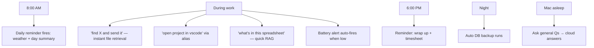

# Smart Usage Guide (Part 6)

How to actually *use* Kukku well. Grouped example commands (English + Hinglish),
automation ideas, tricks, workflows, and how I'd use it daily. You talk to Kukku
in plain language — these are *examples of intent*, not rigid syntax.

> Kukku understands natural language, so there's no fixed command list — phrase
> things however feels natural. The lists below show the *range* of what it can do.

---

## A. Practical everyday commands

**Files**
1. find my resume
2. send me my resume
3. find the invoice from last month
4. mera aadhaar card dhundo
5. find files about the expense tracker project
6. which file has my meeting notes
7. send me the pdf I made yesterday
8. find presentations about marketing
9. look for my tax documents
10. find that excel with the budget

**Screenshots (OCR)**
11. find the screenshot where docker failed
12. wo screenshot dhundo jisme error tha
13. find the screenshot of the wifi password
14. screenshot with a phone number in it
15. find the screenshot from the bank app

**Questions**
16. explain what an API is
17. summarize the theory of relativity in 3 lines
18. translate "good morning" to Japanese
19. what's 15% of 2400
20. give me a healthy breakfast idea

**Weather**
21. delhi ka weather
22. what's the weather in Mumbai
23. is it going to be hot in Bangalore today
24. weather in London right now
25. aaj Pune mein baarish hogi kya

**Commands**
26. open chrome
27. open vs code
28. open my downloads folder
29. lock my screen
30. put my mac to sleep
31. what's on my clipboard
32. copy "meeting at 5pm" to my clipboard
33. open the file resume.pdf
34. open safari
35. open finder

**Memory / reminders**
36. remember that my office wifi is Office_5G
37. remember my bike number is DL3S1234
38. what do you remember
39. remind me at 6pm to take medicine
40. har roz subah 8 baje standup yaad dilana
41. remind me in 30 minutes to check the oven
42. show my reminders
43. cancel reminder 2
44. set alias: my cv = ~/Documents/cv.pdf
45. forget the wifi memory

**Web**
46. who won the last cricket world cup
47. aaj gold ka rate kya hai
48. latest news about AI
49. current USD to INR rate
50. who is the CEO of OpenAI

---

## B. Advanced commands (combine capabilities)

51. find my resume and send it
52. find my latest invoice and tell me the total
53. what's in my budget spreadsheet
54. summarize the pdf I made about the nova project
55. find the screenshot where docker failed and tell me the error
56. open the nova project in vscode
57. remind me every friday at 6pm — actually daily 6pm — to submit timesheet
58. what files did I create this week about marketing
59. read my notes.md and give me 3 action items
60. find my aws screenshot and read the keys back (then rotate them!)
61. compare what's in resume.pdf vs resume_v2.pdf
62. search my code for the telegram bot token usage
63. find the largest pdf in my documents
64. what's the weather and remind me to carry an umbrella if it'll rain
65. open my most recently edited project in vscode
66. find my meeting notes from the client call
67. summarize my last 5 messages
68. remember the top result of that search as "important doc"
69. read budget.xlsx and tell me my biggest expense category
70. find all screenshots with error messages

**Hinglish advanced**
71. mera latest resume dhundh ke bhej do
72. nova project ko vscode mein kholo
73. kal 9 baje meeting ki yaad dilana
74. mere documents mein sabse important pdf kaunsi hai
75. wo file dhundo jisme maine telegram notifications banaye the
76. mere expense wale excel se batao sabse zyada kharcha kis pe hua
77. screenshot dhundo jisme docker error tha aur error batao
78. mujhe har subah weather aur mera din ka summary bhejo
79. downloads folder kholo aur latest file batao
80. mere saare reminders dikhao aur purane cancel kar do

---

## C. Automation ideas (set-and-forget)

81. daily 8am: weather briefing
82. daily 9am: standup reminder
83. daily 10pm: "backup your work" reminder
84. weekday 6pm: submit timesheet reminder
85. daily 1pm: lunch reminder
86. daily 11pm: "plug in your laptop" reminder
87. Monday-ish daily 9am: weekly planning reminder
88. daily 7am: "check calendar" (until Calendar is integrated)
89. daily 8pm: "log today's expenses"
90. hourly-ish: rely on battery alerts (automatic)
91. auto: low-battery warning (automatic, no setup)
92. auto: disk-almost-full warning (automatic)
93. auto: nightly DB backup (automatic)
94. daily reminder to drink water at 11am, 3pm (set two)
95. daily 6:30am: gym reminder
96. daily 9:30pm: journal reminder
97. daily 8am: "top 3 tasks today?" prompt
98. daily reminder to review reminders (meta!)
99. remind me monthly-ish (set a daily then cancel) to pay rent
100. daily 5pm: "wrap up work" nudge

---

## D. Hidden tricks

101. Follow-ups work: "find my resume" → "now send it" → "make it the alias 'cv'".
102. Aliases shorten commands: after "my cv = path", just say "open my cv".
103. Voice notes in Hindi transcribe and execute like text.
104. Ask in Hinglish, it replies in Hinglish (matches your script).
105. `/status` gives CPU/RAM/disk + index size + active AI provider instantly.
106. `/reindex` picks up newly added files/screenshots (and Hindi OCR after install).
107. `/clear` makes it forget the current conversation (fresh context).
108. `/memory` lists everything it remembers.
109. It reads *inside* files — search content even if you forgot the filename.
110. Recency boost: recently edited files rank higher, so "find my resume" favors
     the newest one.
111. Search caches for 60s — repeat searches are instant.
112. It can read a screenshot's text and answer questions about it.
113. Weather works for any city worldwide, no key needed.
114. When Groq is busy it silently uses Gemini — you never see the switch.
115. When your Mac is off, it still answers general questions from the cloud.
116. It knows the current time, so "in 30 minutes" and "at 5pm" both work.
117. Set a daily reminder, then cancel it later for one-off "recurring until done".
118. Ask "what do you remember" to audit stored facts before sharing your screen.
119. It can copy text to your Mac clipboard remotely ("copy X to clipboard").
120. The dashboard shows which files failed to index and why.

---

## E. Productivity workflows

**Morning routine**
- Set once: "har roz 8 baje weather aur mera din batao" → daily nudge.
- Ask: "top 3 things I should focus on today" (it'll use your memories/context).

**Finding & sending work**
- "find the deck I made for the client and send it" → search + deliver in one go.

**Project switching**
- Set aliases per project ("nova = ~/nova"), then "open nova in vscode".

**Meeting prep**
- "find my notes from the last client call and summarize action items."

**Expense tracking**
- "read budget.xlsx and tell me this month's biggest category."

**Screenshot archaeology**
- "find the screenshot where the deploy failed and tell me the error."

**End of day**
- Reminder at 6pm: "wrap up + push code". Ask: "summarize what I asked you today."

---

## How I'd use Kukku every day (if I were you)

My daily loop:
1. **Morning:** the 8am reminder gives me weather; I ask "top 3 tasks today?".
2. **All day:** I never hunt for files — I ask ("find the invoice", "send my
   resume"). I open projects by alias. I ask spreadsheets/PDFs questions directly.
3. **Voice when hands are busy:** cooking/driving, I send a voice note.
4. **Reminders for everything:** medicine, standups, "plug in the laptop".
5. **The Mac watches itself:** battery/disk alerts + nightly backup, no effort.
6. **Away from desk:** general questions still answered from the cloud.

The mindset shift: **stop navigating Finder and Spotlight — just ask.** Kukku
turns "where did I put that?" and "remind me later" from friction into one sentence.

Next: [FEATURES.md](FEATURES.md) for the internals, or [FAQ.md](FAQ.md).
