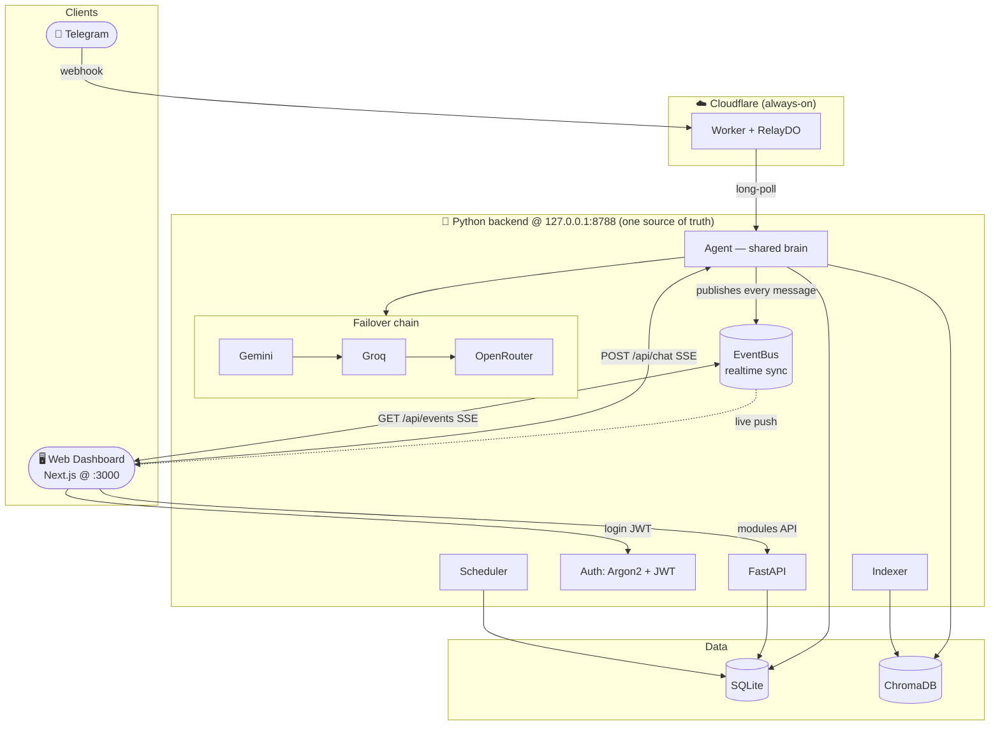
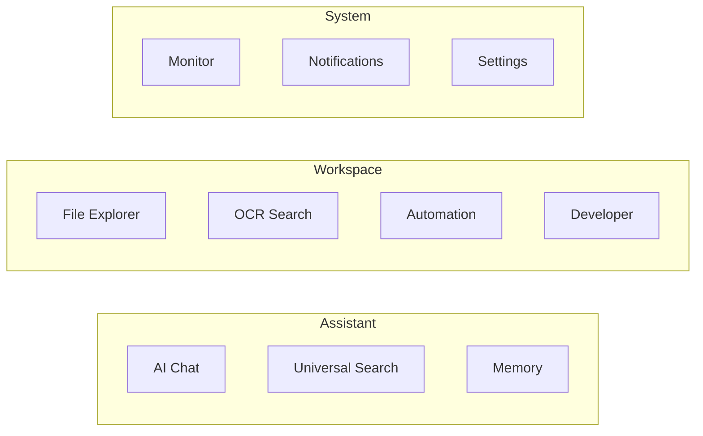
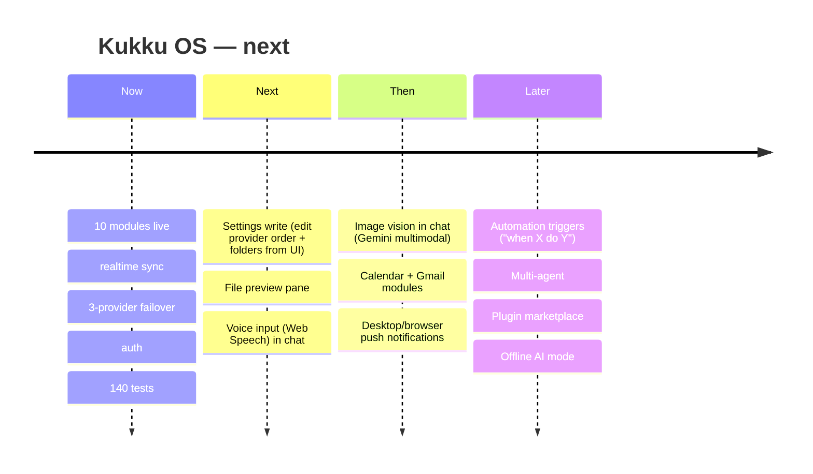

# Kukku OS — Web Dashboard (Complete Guide)

The Telegram bot became a **Personal AI Operating System**: the same brain, now
with a premium web dashboard as a **second client to the same backend**. This doc
is the deliverable bundle: architecture, user guide, feature guide, API docs, and
roadmap.

---

## 1. Architecture Diagram

Two clients, one backend, one database — no duplicated logic.

**The key idea:** whether a message comes from Telegram or the dashboard, it runs
through the **same `Agent`**, writes to the **same SQLite**, and is **published to
the same EventBus** — so both clients see it live. That's how "everything syncs."

---

## 2. Dashboard User Guide

### Getting in
1. **Create your login** (once, on your Mac — password never leaves it):
   `cd ~/jarvis && ./.venv/bin/python scripts/set_password.py`
2. **Start it:** `~/jarvis/scripts/web.sh` → open **http://localhost:3000**
3. Sign in. Sessions use JWT (30-min access, auto-refreshed for 7 days).

### The modules

| Module | What you do |
|---|---|
| **AI Chat** | Talk to Kukku (streams live). Watch a Telegram message appear here instantly. Copy replies; see which provider answered + latency. |
| **Universal Search** | One bar over files, screenshots (OCR), memory, aliases — by meaning. |
| **Memory** | See/add/delete what Kukku remembers; export to JSON. |
| **File Explorer** | Browse indexed files, filter by type, download, or reveal in Finder. |
| **OCR Search** | Find screenshots by the text inside them. |
| **Automation** | Create one-time or daily reminders (fire on Telegram); cancel them. |
| **Developer** | Live activity feed + tail of the backend log. |
| **Monitor** | Live CPU/RAM/disk rings + per-provider latency/tokens/failures. |
| **Notifications** | Live incoming messages + rejected-access alerts. |
| **Settings** | View provider priority, folders, and config. |

### Live sync in action
Open Chat on the dashboard, then send the bot a message on Telegram — it appears in
the dashboard chat within a second. Send from the dashboard, and it's in your
Telegram history. Same memory, same everything.

---

## 3. Feature Guide (what's new vs. Telegram-only)

| Feature | How it works |
|---|---|
| **Multi-provider failover** | `Gemini → Groq → OpenRouter`, configurable via `LLM_PRIORITY`. Auto-retry on 429/timeout/empty, per-provider cooldowns, transparent switch. |
| **Provider observability** | Every call records latency, tokens, failures, active provider (shared `METRICS`), shown on Monitor. |
| **Secure auth** | Argon2id password hash, JWT access+refresh, login lockout after 5 fails, login-only (no signup). |
| **Realtime sync** | In-process `EventBus`; the Agent publishes every message; dashboards stream `/api/events` (SSE). |
| **Streaming chat** | `POST /api/chat` streams tokens over SSE from the shared agent. |
| **Premium UI** | Next.js 14, dark-first, Inter, glassmorphism, Framer Motion, Apple-HIG feel. |

Everything from the Telegram build still applies (file search, OCR, voice,
reminders, Hinglish) — see [FEATURES.md](FEATURES.md).

---

## 4. API Documentation (dashboard endpoints)

All under `http://127.0.0.1:8788`. Auth endpoints are open; everything else needs
`Authorization: Bearer <access_token>` (SSE endpoints take `?token=`).

### Auth
| Method | Path | Body / notes |
|---|---|---|
| GET | `/api/auth/status` | `{configured, user}` — does an account exist? |
| POST | `/api/auth/login` | `{username, password}` → `{access_token, refresh_token, ...}` |
| POST | `/api/auth/refresh` | `{refresh_token}` → new tokens |
| POST | `/api/auth/logout` | (client drops tokens) |
| GET | `/api/auth/me` | `{user}` |

### Chat & realtime
| Method | Path | Notes |
|---|---|---|
| POST | `/api/chat` | `{message}` → **SSE**: `token` events, then `done` (`provider`, `latency_ms`, `files`) |
| GET | `/api/chat/history?limit=` | unified conversation (same as Telegram) |
| POST | `/api/chat/clear` | wipe conversation |
| GET | `/api/events?token=` | **SSE** realtime feed of all messages (sync) |

### Modules
| Method | Path | Purpose |
|---|---|---|
| GET/POST | `/api/memory` · DELETE `/api/memory/{id}` · GET `/api/memory/export` | memory CRUD |
| GET | `/api/search?q=` | universal search |
| GET/POST | `/api/reminders` · DELETE `/api/reminders/{id}` | reminders |
| GET | `/api/files/list?q=&type=` | indexed files |
| GET | `/api/files/download?path=` | download (indexed + under-home only) |
| POST | `/api/files/reveal` | reveal in Finder |
| GET | `/api/ocr/search?q=` | screenshots by OCR text |
| GET | `/api/activity` · `/api/logs/tail` | developer feed |
| GET | `/api/settings` | config view |
| GET | `/api/notifications` | alerts + recent |
| GET | `/api/status` | system + provider metrics (open, for Monitor) |

See [API_REFERENCE.md](API_REFERENCE.md) for the agent tools and worker endpoints.

---

## 5. Future Upgrade Roadmap

**Prioritized next 5**
1. **Settings write-through** — edit provider priority, folders, thresholds from the
   UI (currently read-only; edits go via `.env` + restart).
2. **File preview pane** — inline preview for PDFs/images/text in File Explorer.
3. **Voice input** in the dashboard chat (Web Speech API → same agent).
4. **Image vision** — drag an image into chat, Gemini describes/answers.
5. **Calendar + Gmail modules** — the last big integrations (OAuth).

Each fits the existing shared-backend pattern — see [EXTENDING.md](EXTENDING.md).

---

## Definition of Done — status

✅ Telegram · ✅ Dashboard · ✅ Login · ✅ AI Chat (both clients) · ✅ Hinglish ·
✅ Gemini · ✅ Groq · ✅ OpenRouter · ✅ auto failover · ✅ OCR · ✅ File Search ·
✅ Memory · ✅ **Dashboard ↔ Telegram sync** · ✅ 140 tests pass · ✅ docs updated ·
✅ no known critical bugs.
