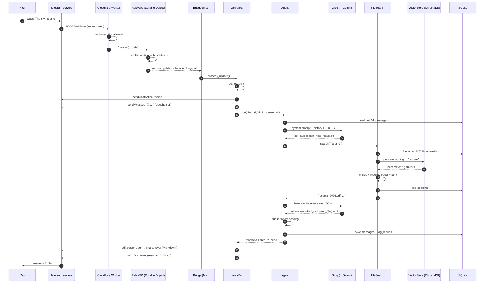
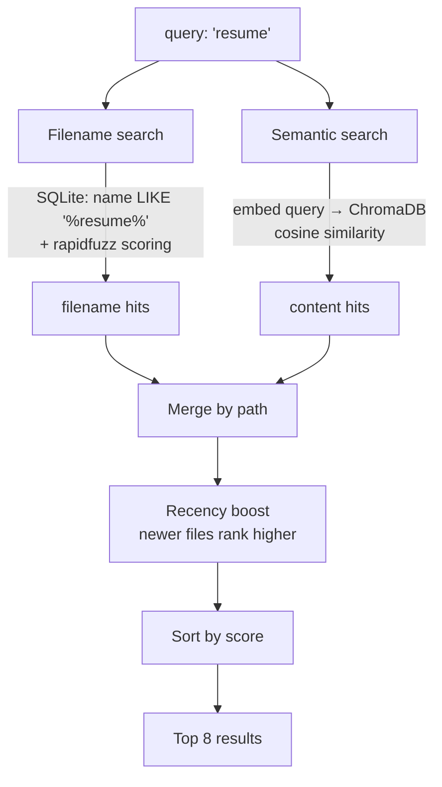

# End-to-End Workflow (Part 3)

This traces **one message — "find my resume" — through every single step**, naming
every function, class, API call, and storage location it touches. If you
understand this one journey, you understand the whole system.

---

## The full journey at a glance



Now the same journey, **step by step**, with the real code.

---

## Stage 1 — Telegram to the Cloud (the outside world)

### Step 1: You send a message
You type "find my resume". Telegram's servers receive it. Because a **webhook** is
configured (via `setup_cloud.sh`), Telegram immediately does an HTTP `POST` to your
Cloudflare Worker's `/webhook` URL, carrying the message as JSON (an "update").

> **What's a webhook?** Instead of your program constantly asking Telegram "any new
> messages?" (polling), you give Telegram a URL and it pushes messages to you the
> instant they arrive. Faster and cheaper. See [GLOSSARY.md](GLOSSARY.md).

### Step 2: The Worker authenticates the request
In `cloud/worker.js`, `handleWebhook()` runs:

```js
if (request.headers.get("x-telegram-bot-api-secret-token") !== env.WEBHOOK_SECRET)
    return json({ error: "unauthorized" }, 401);
```

Telegram includes a **secret token** it was told during webhook setup. If it
doesn't match, the request is rejected — this stops anyone who guesses your Worker
URL from injecting fake messages.

Then it checks the **allowlist**: your Telegram user ID must be in
`ALLOWED_USER_IDS`, or the message is silently dropped. Strangers get nothing.

### Step 3: The Worker hands the message to the Durable Object
The Worker calls the `RelayDO` Durable Object's `/deliver`:

```js
const r = await relayStub(env).fetch("https://do/deliver", {method:"POST", body: JSON.stringify(update)});
online = (await r.json()).online;
```

The Durable Object is a **real-time mailbox**. It checks: *is the Mac currently
long-polling?* (Is there a waiting `/pull` request, or did the Mac pull within the
last 30 seconds?)
- **Yes → online:** it puts the message in its queue and immediately wakes the
  waiting `/pull` so the Mac gets it instantly. Returns `{online: true}`.
- **No → offline:** returns `{online: false}`, and the Worker answers your
  question itself using Gemini→Groq (this is the "Mac is off" path).

Since your Mac is on, `online: true`, and the Worker replies `{ok:true, via:"mac"}`
to Telegram (Telegram just needs a 200 OK; the actual answer comes later).

---

## Stage 2 — The Cloud to your Mac (the bridge)

### Step 4: The Bridge receives the message
Meanwhile, on your Mac, `app/bot/bridge.py`'s `CloudBridge._poll_loop()` has been
sitting with an open `POST /pull` request to the Worker (a **long-poll** — the
request stays open up to 20 seconds waiting for something to arrive). The Durable
Object's wake-up in Step 3 causes that request to return **with your message
inside it**:

```python
updates = r.json().get("updates", [])
...
for data in updates:
    update = Update.de_json(data, self.ptb_app.bot)
    await self.ptb_app.update_queue.put(update)
```

The raw JSON becomes a `telegram.Update` object and is put on the bot's internal
queue. The Bridge immediately re-polls, ready for the next message.

> **Why long-poll instead of a tunnel?** Your Mac is behind a home router — the
> internet can't connect *in* to it. But it can always connect *out*. So the Mac
> reaches out and holds a line open. No tunnel to break. See
> [ARCHITECTURE.md](ARCHITECTURE.md#6-design-decisions-and-why).

---

## Stage 3 — Inside the bot (authentication + presentation)

### Step 5: The bot authenticates (again) and reacts
`python-telegram-bot`'s dispatcher pulls the update off the queue and routes it to
the text handler `JarvisBot.on_text()` in `telegram_bot.py`. First thing it does:

```python
if not self._authorized(update):
    return await self._reject(update)
```

`_authorized()` checks your user ID against `settings.allowed_ids`. (Defense in
depth: the Worker already checked, but the Mac checks too.)

### Step 6: "Typing…" and a placeholder
`_handle_query()` runs:
```python
await context.bot.send_chat_action(chat_id, ChatAction.TYPING)   # shows "typing…"
placeholder = await update.effective_message.reply_text("💭 …")   # a message to edit
```
This gives you instant feedback while the AI thinks. The placeholder message will
be **edited in place** as the answer streams in.

---

## Stage 4 — The Agent (the brain)

### Step 7: The agent starts a turn
`Agent.run(chat_id, "find my resume")` in `core/agent.py`:

```python
history = self.db.recent_messages(chat_id, limit=24)   # from SQLite
messages = [...history..., {"role": "user", "content": "find my resume"}]
```

It loads the last 24 messages (so the AI has context — "my resume" makes sense
because it remembers who "my" is) from the **`messages`** table in SQLite.

### Step 8: The agent asks the AI what to do
```python
turn = await self.provider.turn(
    system=self._system_prompt(),   # instructions + your memories + current time
    messages=messages,
    tools=TOOLS,                    # the menu of 12 things it can do
    on_text=on_stream,              # streaming callback
)
```

- `_system_prompt()` builds the AI's instructions: who it is, the rules (search
  files before answering, reply in the user's language), your saved memories and
  aliases, and the current local time.
- `TOOLS` is a list of JSON schemas describing each tool (`search_files`,
  `send_file`, etc.).
- `self.provider` is the `FailoverProvider` — it tries **Groq** first.

### Step 9: The AI decides to search
The AI reads "find my resume", sees it has a `search_files` tool, and responds not
with text but with a **tool call**:

```json
{ "name": "search_files", "input": { "query": "resume" } }
```

This comes back as `turn.tool_calls`. The agent logs it and dispatches it.

> **This is tool calling** — the core idea. The AI doesn't search; it *requests*
> that the search tool be run with certain arguments. The Python code runs it and
> reports back. See [AI_ARCHITECTURE.md](AI_ARCHITECTURE.md).

---

## Stage 5 — File Search (the actual work)

### Step 10: FileSearch runs two searches in parallel concepts
`Agent._run_tool("search_files", {"query": "resume"})` calls
`FileSearch.search("resume")` in `search/file_search.py`. This does **two** things
and merges them:



**a) Filename search** (`_filename_search`): asks SQLite for files whose name
contains "resume", then scores each with `rapidfuzz` (fuzzy string matching — so
"resme" still matches "resume").

**b) Semantic search** (`vector_store.query`): converts "resume" into a 384-number
**embedding** using the sentence-transformer model, then asks ChromaDB for the
stored file-chunks whose embeddings are closest (cosine similarity). This finds
files *about* resumes even if the word "resume" isn't in the filename (e.g., a file
called `manish_cv.pdf`).

**c) Merge + boost + rank:** results from both are merged by file path (a file
matching both ways scores higher), recently-modified files get a small boost, and
the top 8 are returned. The search is also **logged** to the `search_history`
table and **cached for 60 seconds**.

### Step 11: Results go back to the AI
The agent turns the results into JSON and sends them back to the AI as a
"tool result":

```json
[{"path": "/Users/you/Documents/resume_2026.pdf", "name": "resume_2026.pdf",
  "score": 0.94, "snippet": "..."}, ...]
```

---

## Stage 6 — The AI composes the answer

### Step 12: The AI reads results and decides to send the file
The agent loops back (Step 8 again) with the search results now in the
conversation. The AI sees a strong match and responds with **both** a text answer
*and another tool call*:

```json
{ "text": "Found your resume 👇",
  "tool_calls": [{ "name": "send_file", "input": { "path": ".../resume_2026.pdf" } }] }
```

`send_file` doesn't send immediately — it validates the file exists and is under
50MB, then adds it to `reply.files_to_send`. The agent loops one more time; the AI
now has nothing left to do and returns final text. The loop ends.

> **The loop can run up to 8 rounds** (`MAX_TOOL_ROUNDS`). Each round is one
> AI request. Simple questions take 1 round; "find and send a file" takes 2–3.

### Step 13: Everything is saved
Before returning, the agent records the exchange:
```python
self.db.add_message(chat_id, "user", "find my resume")
self.db.add_message(chat_id, "assistant", reply.text)
self.db.log_request(chat_id, "text", ..., duration_ms=...)
```
This is why the conversation has memory and the dashboard shows history.

---

## Stage 7 — The reply travels back

### Step 14: The bot delivers text + file
Back in `_handle_query()`:
```python
await self._finalize(placeholder, reply.text)       # edits placeholder → final Markdown
for path in reply.files_to_send:
    await context.bot.send_document(chat_id, fh, filename=path.name)
```

The placeholder "💭 …" message is **edited** into the final answer (with Markdown
formatting; if the Markdown is malformed it retries as plain text). Then each file
is uploaded via Telegram's `sendDocument` API.

### Step 15: You get your answer
Telegram delivers the text and the `resume_2026.pdf` file to your chat. Total time:
usually 2–5 seconds.

---

## Where the data lived at each step

| Data | Lived in | Table/Collection |
|---|---|---|
| Your message + the reply | SQLite `data/jarvis.db` | `messages` |
| The search you did | SQLite | `search_history` |
| The request (for the dashboard/audit) | SQLite | `request_log` |
| The file's searchable "fingerprint" | ChromaDB `data/chroma/` | `files` collection |
| The file's metadata (name, size, path) | SQLite | `indexed_files` |
| The actual resume file | Your real filesystem | `~/Documents/` |
| The Mac's tunnel URL / mailbox | Cloudflare Durable Object | in-memory |

---

## Variations on the journey

- **"who won the world cup?"** → AI calls `web_search` instead of `search_files`;
  that tool uses Gemini's Google grounding.
- **"remind me at 5pm to call mom"** → AI calls `set_reminder`; the scheduler fires
  it later with zero AI cost.
- **A voice note** → `on_voice()` downloads the audio, `Transcriber` turns it into
  text, then it follows the exact same path from Step 5.
- **Mac is asleep** → the journey stops at Step 3; the Worker answers from the
  cloud with a "💤 Mac offline" note.

Next: [AI_ARCHITECTURE.md](AI_ARCHITECTURE.md) for how the AI brain works in depth.
